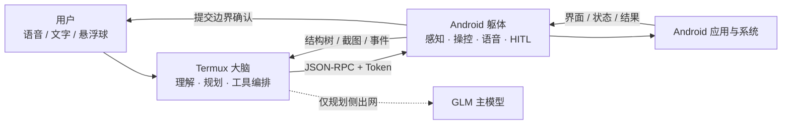
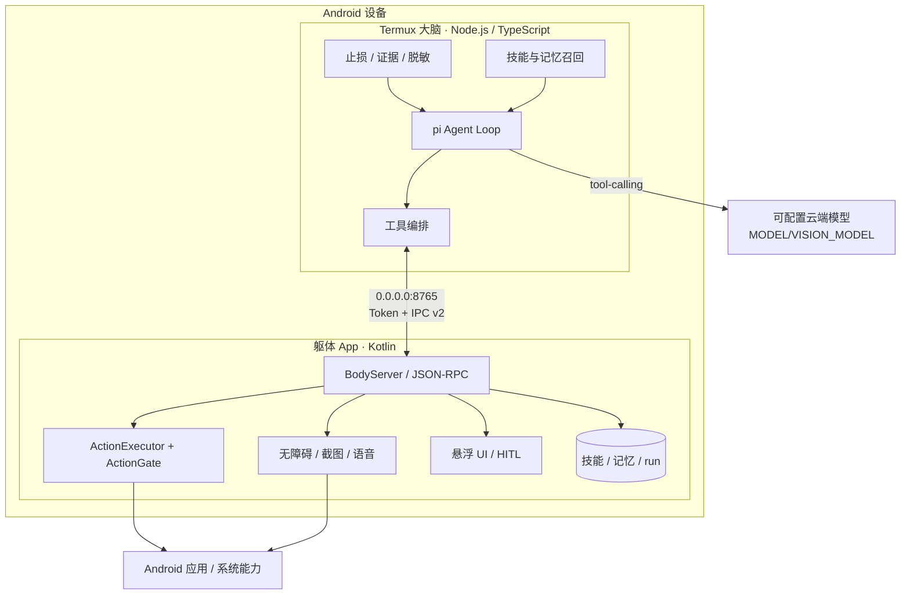
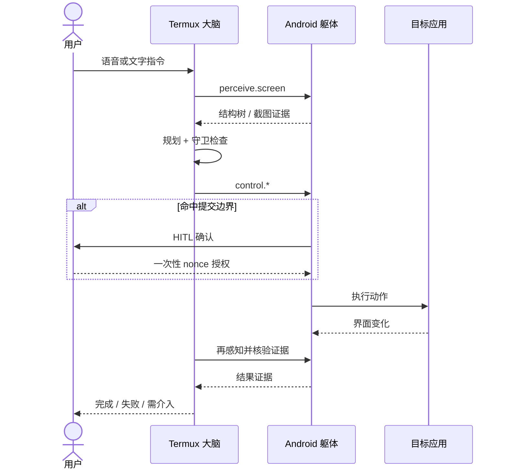

# SuperAgent-Android

> 把 Pi 级智能大脑装进 Termux，让手机成为它的躯体——能听、能说、能看、能动手、能感知，越用越懂你。

**Android 深度定制超级 AI 助手**：双进程架构（Termux 大脑 + Android 躯体）+ 端侧语音 + 可编程 Agent + 技能自学习 + 三档位深度操控（免 root → Shizuku → AOSP）。

[]()
[](LICENSE)
[]()
[](docs/07-接口规格说明书.md)

---

## 当前状态（2026-08-21）

`v0.1.0` 已打标签；当前 `main` 比标签多 8 个安全/记忆提交，处于 post-release 审计与 P1 整改阶段。历史 P0 真机闭环有效，但本轮代码审计发现视觉、终态、暂停和安全内层旁路，状态按当前事实重新标注：

| 里程碑 | 状态 | 说明 |
|---|---|---|
| M0 安全绿 | ✅ | Token 鉴权 + 协议版本 + 错误码全量 |
| M1 红线绿 | ◐ | 主安全链成立；selectOption 最终内部坐标闸待补（docs/16 C-01） |
| M2 闭环绿 | ✅ | 真机端到端：文字指令→规划→操控→证据核验→技能固化 |
| M3 飞轮绿 | ✅ | 技能回放（签名步进校验）+ 状态机（candidate→verified） |
| G5 交互绿 | ◐ | 悬浮 UI 可用；暂停/继续与离线输入协议未闭环 |
| M4 语音绿 | ◐ | ASR 与在线播报有真机证据；本地 sherpa TTS 当前禁用，系统 TTS 兜底 |
| M5 工程绿 | ◐ | 本轮 brain 25 smoke+6 integration、body 81 JVM 与 Debug APK 构建全绿；真机未复验 |
| ME 记忆 | ◐ | SQLite、反思、归档、备份已实现；注入覆盖/重复归档/快照治理待修 |

审计详情见 [docs/16](docs/16-当前架构代码审计-2026-08-21.md)，整改后的当前方案见 [docs/17](docs/17-当前方案设计.md)。



## 架构



| 层 | 拥有的权力 | 不应承担 |
|---|---|---|
| 大脑 | 理解意图、拆解任务、选择工具、判断证据 | 直接执行 Android 手势或绕过安全门 |
| 躯体 | 读取端侧状态、执行动作、管理敏感会话和确认 | 自行决定用户业务意图 |
| 云模型 | 生成计划与工具参数 | 持有设备执行权、端侧数据权威 |
| 用户 | 授权高风险动作、随时暂停或终止 | 为普通低风险步骤逐项确认 |

**安全铁律**：大脑只“想”，躯体才“做”。`ActionExecutor`、`ActionGate`、敏感会话和 HITL nonce 主链已经落地；当前仍有 selector 内部最终 tap 未过坐标闸的审计缺口，修复前不宣称所有路径绝对不可绕过。

**感知阶梯**：L0 a11y 已实现；L1 screenshot/blob/VLM 与 L2 auto 骨架存在，但 MediaProjection 授权 attach 和 WebView 信号路由待修，当前标记为部分完成。

### 一次任务如何闭环



## 快速开始

### 前置

| 依赖 | 最低要求 | 用途 |
|---|---|---|
| Android 真机 | Android 8.0+（API 24）、arm64-v8a | 运行躯体、无障碍和端侧模型 |
| Android 工具链 | SDK compileSdk 35、JDK 17+ | 构建与安装 APK |
| Node.js | 20+ | 运行 Termux 大脑与验证脚本 |
| GLM API Key | [智谱开放平台](https://open.bigmodel.cn/) | 当前云端规划模型 |

### 获取模型

```bash
bash scripts/fetch-models.sh   # 下载 sherpa-onnx .so + ASR/TTS/声纹模型（当前约 978MB）
```

### 躯体（Android）

```bash
cd body
./gradlew :common:test :core:testDebugUnitTest   # 当前 168 项 JVM 单测
./gradlew :app:assembleDebug                     # Debug APK 当前约 1.01GB
bash scripts/install.sh                          # 装机 + token 桥接
```

装机后在手机上：开无障碍 → 授权悬浮窗 → 启动躯体服务 → 侧边出现控制球。

### 大脑（PC 直连 / Termux）

```bash
cd brain
npm install
export GLM_API_KEY=你的key
npm run typecheck && npm run contract && npm run smoke && npm run integration
adb forward tcp:8765 tcp:8765    # PC 直连真机
BODY_URL=http://127.0.0.1:8765 BODY_TOKEN=$(adb shell run-as com.superagent.body cat files/token | tr -d '\r\n') npm run start
```

不接 PC 可使用悬浮球和文字输入；暂停/继续仍处于协议整改期，不应作为稳定能力验收。

## 验证流水线

| 范围 | 命令 | 当前证据 |
|---|---|---|
| brain 类型 | `npm run typecheck` | 通过 |
| IPC 契约 | `npm run contract` | 34 个共享类型一致 |
| brain 行为 | `npm run smoke` | 25 项通过 |
| brain 集成 | `npm run integration` | 6 项通过 |
| body JVM | `:common:test :core:testDebugUnitTest` | 168 项通过 |
| APK 构建 | `:app:assembleDebug` | 本轮通过 |
| 真机 | 装机验收 | 本轮尚未复验 |

```bash
# brain
cd brain && npm run typecheck && npm run contract && npm run smoke && npm run integration

# body
cd body && ./gradlew :common:test :core:testDebugUnitTest :app:assembleDebug
```

## 目录结构

```

### 文档怎么读

| 你想了解 | 首选文档 | 定位 |
|---|---|---|
| 快速接手项目 | [项目导读与审计交接](docs/00-项目导读与审计交接.md) | 入口、边界、验证方式 |
| 当前系统实际上怎么工作 | [架构设计与移交基线](docs/05-架构设计与移交基线-v2.md) | 当前架构事实源 |
| 当前有哪些风险 | [当前架构代码审计](docs/16-当前架构代码审计-2026-08-21.md) | 证据、等级、整改建议 |
| 下一版准备怎么改 | [当前方案设计](docs/17-当前方案设计.md) | 目标架构与分批方案 |
| 查功能完成度 | [功能规格与追踪矩阵](docs/06-功能规格清单与追踪矩阵.md) | FR 状态和证据 |
| 查 RPC 与错误码 | [接口规格说明书](docs/07-接口规格说明书.md) | IPC v2 契约 |
| 理解关键取舍 | [架构决策记录](docs/09-架构决策记录.md) | ADR 与约束 |
super-agent/
├─ docs/
│  ├─ 00-项目导读与审计交接.md      # 新人入门单一入口
│  ├─ 05-架构设计与移交基线-v2.md   # 架构事实源（含交互层 §6）
│  ├─ 06-功能规格清单与追踪矩阵.md   # 需求事实源（45+ FR）
│  ├─ 07-接口规格说明书.md          # 接口事实源（IPC v2 全量）
│  ├─ 08-非功能需求与验收测试计划.md # 质量事实源（TC-01~14 + 验收报告）
│  ├─ 09-架构决策记录.md           # AD-01~14
│  ├─ 10-P0冲刺计划-重排版.md       # 里程碑与滚动任务池
│  ├─ 12-产品体验需求-用户旅程视角.md # UX 行为基线（GPT sol 审计）
│  ├─ 13-多智能体分工与协作规约.md
│  ├─ 15-记忆与自进化架构.md       # 记忆专题设计
│  ├─ 16-当前架构代码审计-2026-08-21.md # 当前审计事实
│  └─ 17-当前方案设计.md           # 审计后目标方案
├─ brain/src/
│  ├─ ipc/           # BodyClient + BrainEvent 上报
│  ├─ tools/         # 感知/操控/语音/技能/记忆/HITL/finish 工具
│  ├─ guards/        # ReAct 止损 + 证据闸门 + 脱敏 + 相关性 + VLM
│  ├─ personas/      # 角色系统 + 系统提示
│  └─ model.ts       # GLM 主/备用/本地三档降级链
├─ body/
│  ├─ common/        # 纯 JVM：协议契约 + 词表守卫 + 技能索引
│  ├─ core/          # Android：RPC/感知/操控/语音/HITL/技能/悬浮UI/截图
│  └─ app/           # 应用：主界面 + 前台服务 + 悬浮球 + 输入面板
├─ scripts/          # fetch-models / install / deploy-brain / rpc-concurrency-test
├─ third/sherpa-onnx/ # v1.13.2 vendored（.so 脚本获取）
└─ .github/workflows/ci.yml  # GitHub Actions CI
```

## 核心能力

| 能力 | 实现 |
|---|---|
| **语音输入** | SenseVoice 端侧 ASR（16kHz，静音断句） |
| **语音输出** | 在线 edge/azure 合成 → body 内存播放；失败时系统 TTS，sherpa 本地路径待恢复 |
| **屏幕感知** | a11y ✅；截图/VLM/auto ◐（授权与 WebView 路由待修） |
| **操控** | tap/swipe/type/select/back/home/launch；主路径走 ActionExecutor，内部 selector 闸待补 |
| **安全** | 提交边界词表 + 坐标全节点校验 + 敏感会话 + HITL nonce 一次性消费 |
| **技能** | learn（轨迹固化）→ run（签名步进校验回放）→ feedback（candidate→verified→active） |
| **守卫** | ReAct 止损（5 类退化+豁免通道）+ 证据闸门（存在性+新颖性+相关性）+ 脱敏 |
| **记忆** | SQLite 记忆、成功/失败反思、run 归档、Termux 快照恢复（治理待加强） |
| **交互** | 悬浮球+状态条+输入面板+OFFLINE 心跳；暂停/继续 ◐ |

## 路线图

| 阶段 | 时间 | 目标 | 状态 |
|---|---|---|---|
| **P0** | 2026-08 | v0.1.0 真机最小闭环 | 已发布；审计缺口转整改 |
| **P1** | 2026-08 → 11 | 安全收口、视觉真实性、状态/记忆可靠性、KWS | 进行中 |
| **P2** | 2026-12 → 2027-02 | Shizuku 档 + 分发 + 种子用户 | 📐 |

## 核心原则

1. **复用成熟方案**——pi 内核不重造、sherpa 一栈不拼凑
2. **本地优先**——ASR/安全/数据权威在端侧；规划与当前主路 TTS 可用云服务并可降级
3. **安全铁律**——提交边界动作 100% 走人工确认；弱模型不授予设备控制权
4. **开源资产入 third/**——版本锁定、相对路径引用、升级只换目录

## 致谢

- [Pi](https://github.com/earendil-works/pi) — Agent 内核
- [sherpa-onnx](https://github.com/k2-fsa/sherpa-onnx) — 端侧语音推理
- Clowder — VoiceConfig 音色契约
- MiraAgent — 系统权威与验证链设计
- Kestrel — 真机操控与 UI 交互模式

## 协议

[Apache License 2.0](LICENSE)。第三方组件各自遵循其原始协议（sherpa-onnx MIT、pi MIT）。
