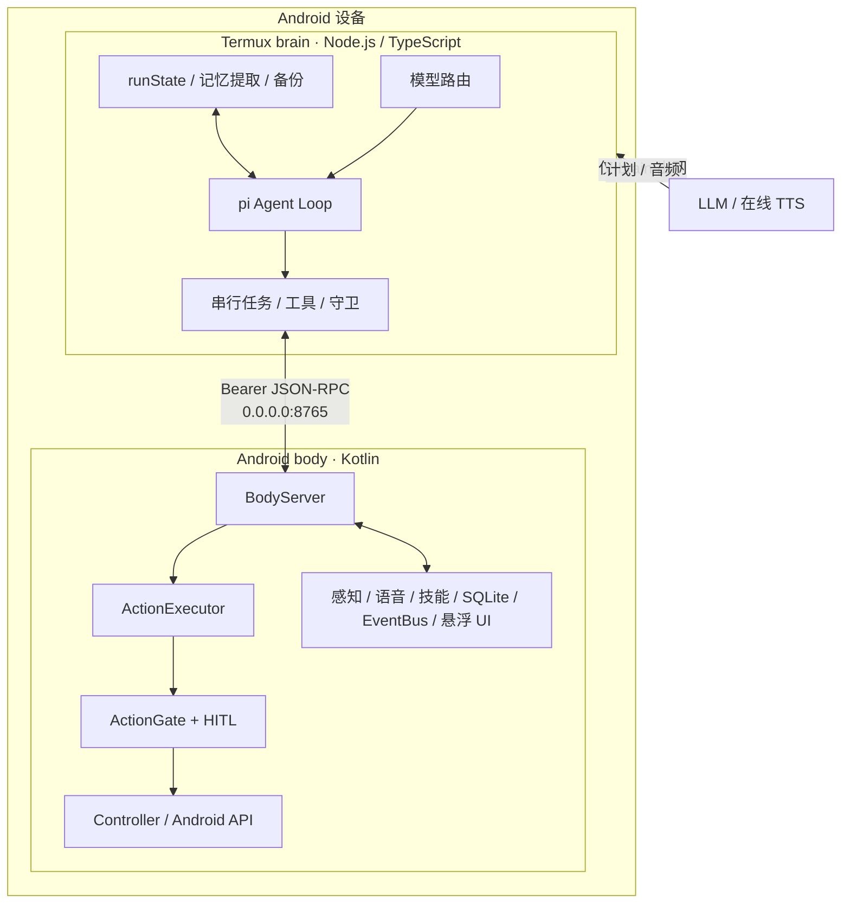
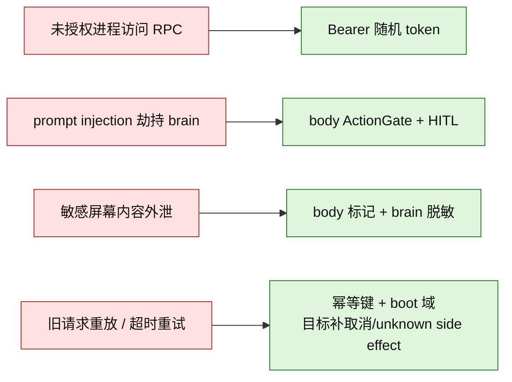
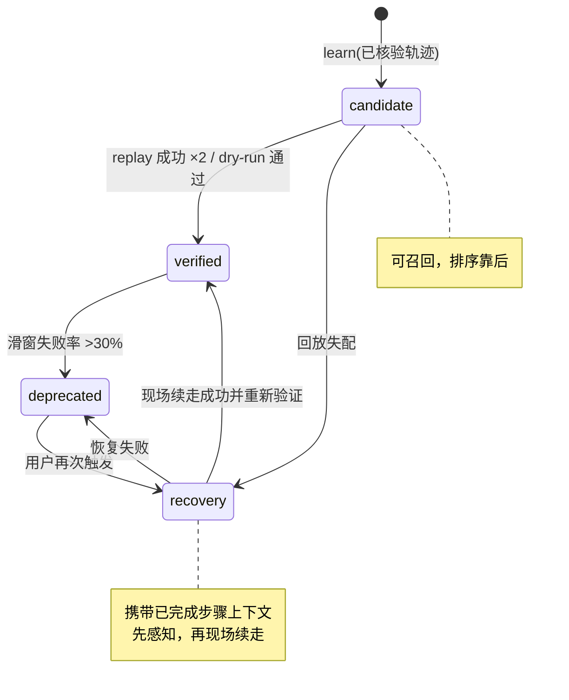

# 超级AI助手 · 架构设计与移交基线 v3

> 文档定位：本文修订并取代 docs/04 的架构部分，是当前实现的**架构事实源**；v3 于 2026-08-21 按 `571828e` 和 `docs/16` 独立审计刷新。
> **交付件文档集**：05 架构 · 06 功能规格与追踪（需求事实源）· 07 接口规格（接口事实源）· 08 NFR 与验收（质量事实源）。四方不一致时按 06 §6 裁决规则处理。
> 当前目标方案与整改顺序见 `docs/17`。✅=代码和对应测试已确认，◐=骨架存在但有审计缺口，📐=目标设计；文档状态不替代真机证据。

---

## 1. 总体架构

### 1.1 双进程拓扑



**职责铁律**：
- brain 负责"想"：规划、推理、工具编排、技能召回。**永远不直接触碰设备 API**。
- body 负责"做"：感知、操控、语音、硬件。**红线与闸门在 body 侧硬实现**，brain 幻觉/被注入也无法绕过（R1/R2 权威分立）。
- body 不主动访问外部云服务；所有 LLM/在线 TTS 出网集中在 brain。body 的 INTERNET 权限用于本机 RPC 服务。

| 关注点 | brain | body | 当前缺口 |
|---|---|---|---|
| 任务决策 | Agent/模型/守卫 | typed denial | 终态单写待收口 |
| 设备动作 | 只发 Action 请求 | 最终坐标校验并执行 | selector 内部 tap 待补闸 |
| 感知 | VLM 解释截图 | a11y preflight/截图权威 | attach/WebView 路由待修 |
| UI | 只发类型化事件 | UI 状态唯一 owner | pause/command ack 待补 |
| 技能 | 召回与恢复规划 | 存储/回放/状态权威 | 随动作闸回归 |
| 记忆 | 提取与 prompt 注入 | SQLite 权威/用户删除 | 注入覆盖/备份治理 |

### 1.2 三档位能力模型

| 档位 | 手段 | 能力 | 状态 |
|---|---|---|---|
| L1 免root | 无障碍服务 + 前台服务 | a11y 操控、语音、HITL；视觉/暂停等部分能力仍需整改 | **当前主档 ◐** |
| L2 Shizuku | ADB 授权提权 | 输入法注入、ForceStop、跨应用边界 | P2 预研（接口缝已留：/health services 能力表） |
| L3 AOSP | 定制 ROM 编译 | 系统级代理、开机自启、全局弹窗拦截 | 远期（市场分析 01 结论：核心卖点，P2 起步） |

**架构约束**：所有功能按"L1 可用"设计，L2/L3 只做增强不做依赖。协议中 `services` 能力表声明 body 当前档位，brain 据此降级。

### 1.3 感知阶梯

| 级 | 通道 | 覆盖 | 延迟 | 状态 |
|---|---|---|---|---|
| L0 | a11y 树（文字/坐标/可点性） | 原生应用 | 设备相关 | ✅ |
| L1 | MediaProjection 截图 → GLM-4.6V | WebView/Canvas/图片 | ~1-2s + 网络 | ◐ 授权回调待接 |
| L2 | L0+L1 混合路由（auto 模式） | a11y 盲区 | 混合 | ◐ WebView 信号待修 |

当前代码已有 screenshot/blob/VLM 骨架，但 `docs/16` 确认 MediaProjection attach 和 WebView auto 判断未闭合。修复并完成真机标定前，不得宣称视觉全线贯通。
a11y 断连时 body 返回 `A11Y_DISCONNECTED` 错误码（区分于白屏），brain 触发通知用户重新开启，不盲目重试。

### 1.4 模型降级阶梯

| 档 | 模型 | 能力承诺 | 触发条件 |
|---|---|---|---|
| M1 | GLM-4.6v 云端 | 完整操控闭环（tool-calling + 视觉） | 默认 |
| M2 | 备用云端供应商（OpenAI 兼容） | 完整操控闭环（无视觉或降级视觉） | GLM 不可达/限流 |
| M3 | 本地 llama.cpp 小模型 | **仅语音闲聊，操控闭环禁用** | 无网/隐私模式 |

**安全铁律**：M3 不授予设备控制权。弱模型 + 设备控制权 = 安全反模式，此约束写死在 brain 模型解析层：M3 时 `buildTools()` 返回空工具集，角色提示词同步切换为闲聊模式。

### 1.5 安全模型（信任边界闭合）



- **随机 token**：body 首启生成 256bit 随机 token 写 `filesDir/token`（App沙箱私有，他App不可读）。Termux 经 `adb shell run-as com.superagent.body cat files/token` 桥接读取，注入 `BODY_TOKEN` 环境变量。默认值 `super-agent-dev` **仅限模拟器调试**，真机构建移除。
- **bootId**：`/health` 每次 body 启动轮换，供重启识别；当前 RpcRequest 不携带 bootId，不能把它描述为逐请求 fencing。
- **协议版本**：`/health` 返回 `protocolVersion`（当前 `2`），brain 启动时校验，不匹配拒绝启动并提示升级方向。
- **提交边界确认**（支付红线 v2，见 §2.2）：body 侧为最高权威，brain 侧为第一道过滤。

---

## 2. 关键方案设计

### 2.1 IPC 协议 v2（brain↔body 契约）

**传输**：HTTP/1.1，body 当前绑定 `0.0.0.0:8765`，用于适配 Android 不同 UID 间的通信限制；随机 token 是当前主要边界。P1 目标为 Unix domain socket/受限转发。

| 端点 | 方法 | 用途 |
|---|---|---|
| `/rpc` | POST | JSON-RPC 请求/响应，`{id, method, params, idempotencyKey?}` |
| `/health` | GET | `{ok, bootId, protocolVersion, uptimeMs, services:{a11y,asr,tts,speaker,kws}}` |
| `/events` | GET | 短轮询 `?since=seq`，`{seq, type: state|hitl|voice|sensor|log, payload}` |
| `/blob/{id}` | GET | Bearer 鉴权截图 JPEG，`Cache-Control: no-store` |

已实现：protocolVersion、typed 错误、请求体 10MB 上限、成功结果 512 条 FIFO 幂等缓存、同 key in-flight 合并、GET blob。当前 handler 超时不会取消后台协程，可能产生 `unknown_side_effect`，见 docs/16 C-10。

**工具方法全景**（brain 侧 `android.*` 工具 ↔ body 侧 RPC method 一一映射）：
```
perceive.screen{mode}          control.{tap,longPress,swipe,typeText,selectOption,selectSpec,back,home,launch}
speech.{asr,say,interrupt,playBytes,playFile,status,voiceprintEnroll,voiceprintIdentify}
hardware.{audioRoute,vibrate,sensor,headset}
skill.{list,search,run,learn,feedback}                                     [search AD-05 R3 新增：检索下沉 body]
memory.{write,search,revise,forget,export,import,maintain}  run.{archive,list}  brain.event
hitl.{confirm,ask,handoff}      task.finish{summary,evidence}            [task.finish 为brain内部]
```

**镜像对齐机制**：`contract.json` 是唯一真源；brain types 与 body Protocol 是镜像，当前 CI 和本地测试校验 34 个共享类型。当前 BodyCore 注册 40 个 RPC。

### 2.2 提交边界确认（支付红线 v2）

**v1 缺陷**：词表黑名单只能拦截字面"支付/收银台"，挡不住 WebView 收银台（a11y 盲区）、非标准措辞、动态页。

**v2 设计：从"内容匹配"升级为"动作语义边界"**

```
提交边界(Commit Boundary) := 动作一旦执行，产生不可逆的外部效应：
  └─ 付款/下单确认 · 发送消息/邮件 · 删除数据 · 公开发布 · 修改账号设置
```

两层防御 + HITL（**见 AD-01/AD-02：业务判定权威单点在 body，brain 不持有词表**）：

```
第1层 body守卫（硬，最高权威，单一判定源）
  ① 词表拦截：selectOption/selectSpec 目标命中 commitPhrases → COMMIT_BOUNDARY
  ② 动作语义标记：launch返回的appPackage ∈ sensitiveAppPrefixes(银行/支付/社交)时，
     body进入"敏感会话"状态，后续命中 sensitiveSessionActionVerbs 的动作强制HITL
  ③ WebView感知：a11y发现WebView节点且 extras.url 命中 sensitiveUrlPatterns
     (pay/checkout/cashier/收银/结算/payment) → 整页标记 sensitive
  ④ 感知下发：ScreenResult 携带 sensitive(节点级)/sensitiveSession(会话级)，
     brain 据此切换审慎模式但不做判定
第2层 HITL（人是否在场是最终权威）
  提交边界动作 → hitl.confirm（通知聚合，60s超时默认拒绝，denial is data）
```

> **AD-01 纠正**：v2 原设计的"第1层 brain 守卫持有词表"已废弃。brain 守卫层只读 body 下发的 `sensitive`/`sensitiveSession` 标记 + 证据闸门，不做业务判定。词表彻底只在 body。

**词表治理**：整词/短语精确匹配（非子串），避免误伤"支付宝分享"面板。词表唯一主源 body `common/src/main/resources/commit_boundaries.json`（AD-02），body `Guard.kt` 加载。词表内容含：`commitPhrases`（提交边界词）、`sensitiveNavPhrases`（敏感导航词）、`sensitiveSessionActionVerbs`（敏感会话内额外确认词）、`sensitiveUrlPatterns`（WebView URL 特征）、`sensitiveAppPrefixes`（敏感App包名前缀）。
**体验对冲**：敏感会话内非提交动作（浏览、加购）不受限，只拦最后一击；HITL 通知聚合（连续确认合并为一次），降低打扰密度。
**敏感会话退出**：`control.home` 调用 `sensitiveSession.onHome()` 重置敏感会话状态；`control.launch` 非敏感App时同样重置。
**WebView URL 检测**：除文字敏感词外，遍历 WebView 节点 extras 中的 `url` 字段，命中 `sensitiveUrlPatterns`（pay/checkout/cashier/收银/结算/payment）→ 整页标记 sensitive。
**感知返回**：`perceive.screen` 的 `ScreenResult` 新增 `sensitiveSession` 布尔字段，brain 据此感知当前是否在敏感App内，可切换审慎模式。

### 2.3 技能生命周期（飞轮完整版）

**v1 缺陷**：一次成功即固化（错误轨迹永久污染），回放 stale 只会失败。

**v2 状态机：**



检索排序：verified > active > candidate；deprecated 沉底不默认展示。

- **skill.learn**（brain 在 task.finish 证据核验通过后自动调用）：固化轨迹 = 步骤列表 + 每步 expected signature（v1 只存 label，v2 存签名，多步技能第 N 步防同名按钮盲点）。
- **skill.run**：逐步回放，每步先校验 signature 匹配；失配 → `SKILL_STALE` + 已完成步骤上下文，brain 转 recovery mode 现场续走（而非从头再来）。
- **skill.feedback**（新增）：任务结束后 brain 回报本次技能使用成败，body 侧累计统计驱动状态迁移。
- 存储：body `filesDir/skills/*.json`，可审计、可手工编辑、可云端同步（P2）。

### 2.4 语音交互主循环（产品真实入口）

**v1 缺陷**：REPL 是开发者入口，语音环只散落为独立工具。

**v2 状态机（body 侧常驻驱动，brain 只参与 thinking/acting）：**

```
        ┌──────┐ KWS唤醒词/长按      ┌─────────┐ VAD静音1.2s
        │ idle │ ──────────────────→ │listening│ ──────────┐
        └──────┘                     └─────────┘            ↓
          ↑ ↑                           ↑ barge-in     ┌─────────┐
          │ │    TTS完成/打断            │(用户说话     │thinking │ GLM规划
          │ └───────────────────────────┤ 即打断TTS)   └────┬────┘
          │                             │                  ↓
      ┌───┴────┐  播报进度/结果   ┌──────┴───┐          ┌─────────┐
      │speaking│ ←───────────────│ acting   │ ←────────┤ 工具执行 │
      └────────┘                 └──────────┘          └─────────┘
```

- **唤醒**：当前入口为通知按钮/悬浮层文字；常驻 KWS 仍是 P1 设计，未注册 `speech.kws_arm` RPC。
- **Barge-in**：body 能中断播放并上报事件；brain 当前仅记录事件，完整下一轮 ASR/恢复策略待补。
- **确认环**：acting 触及提交边界（§2.2）→ 暂停 → 语音播报确认请求 + 通知双通道 → 用户语音/点按应答。
- 会话超时：idle 10min 自动休眠 KWS 低频档。

### 2.5 证据闸门（task.finish 防谎报）

维持 v1 设计并加固：
- task.finish 内部强制重新 `perceive.screen`；
- 证据文字必须满足：**存在性**（当前屏幕可见）+ **新颖性**（不在任务基线屏幕上）+ **长度≥2**；
- 新增（P1）：证据与任务目标的**相关性校验**（轻量 LLM 判分），防"随便指一处新文字交差"；
- 核验通过 → 自动 skill.learn（进 candidate）；失败 → 驳回并要求重新感知，连续 3 次驳回 → 建议转 HITL。

### 2.6 会话持久化与断点续跑（AD-05 修订）

**v1 缺陷**：Termux 被杀任务上下文全丢。

- pi 只用核心 Loop（`Agent` + `pi-ai` Provider），**不用** AgentHarness/Session/JsonlSessionRepo（coding-agent CLI 场景，durability/完整性不足系统级 Agent，见 AD-05）；
- brain 自实现会话持久化（`runState.ts`，参照 Kestrel `RunTraceBuilder`）：失败可见性留痕（成功/失败/崩溃都落全历史）、trace 单调序号、脱敏后落盘；
- 断点续跑：恢复后从最后 trace 步骤重新感知当前屏幕，diff 后决定续走或重规划；
- body 侧技能库/声纹库本就落盘，无状态依赖 brain。

### 2.7 隐私脱敏层

- brain 发送前对屏幕文本节点扫描：命中 `密码/验证码/身份证/卡号/余额` 字样的节点值**打码为 `[REDACTED:类型]`**，仅保留布局结构；
- 感知层 `sensitive` 标记（body 已实现）作为第一道过滤，brain 脱敏为第二道；
- 隐私模式（用户开关）：强制 M3 本地模型 + 脱敏后文本仅入本地日志，不出设备；
- 日志脱敏：事件流与 trace 落盘前过同一脱敏器。

### 2.8 端侧语音栈（sherpa-onnx v1.13.2，资产在 third/）

| 能力 | 模型 | 大小 | 备注 |
|---|---|---|---|
| ASR | SenseVoice int8 zh | ~230MB mmap | 静音1.2s断句，热词表P1 |
| TTS | Kokoro multi-lang v1.0 | ~300MB | **zh voices 必须在 fetch-models 锁定验证**；Plan B: vits-zh-hf-fanchen |
| 声纹 | 3D-Speaker eres2net zh | ~27MB | 注册3句/识别1句，阈值0.7 |
| VAD | Silero v5 | ~2MB | barge-in 与断句共用 |
| KWS | sherpa keyword-spotting zh | ~10MB | P1，自定义唤醒词 |

部署形态：assets 打包，当前本地模型资产约 978MB、Debug APK 约 1.01GB；P1 需拆分按需下载/PAD。实际播报主路为 brain 在线 edge/azure → body `playBytes`；当前构建 `vitsFailed=true`，在线失败后通常走系统 TTS，sherpa 本地路径不得标为稳定主路。
依赖铁律：包名 `com.k2fsa.sherpa.onnx` 不改（JNI 绑定），.so 与 kotlin-api 升级整体替换 third/sherpa-onnx/。

### 2.9 记忆与自进化

- body SQLite `memory.db` 是 memories/runs 权威库；brain 负责检索注入、成功/失败反思和规则化 lesson。
- write/import 已有基础 PII 拒绝；revise 尚未复用该校验（docs/16 C-09）。
- brain 每 6 小时 export 到 Termux JSON 快照并支持人工恢复；当前快照非原子、无校验和，属于“已有恢复手段”而非完整备份保证。
- run 终态当前有重复归档风险；目标为 wrapper 单写、finishRun 幂等（docs/17 §4.3）。

---

## 3. 功能树

```
超级AI助手
├─ 1 大脑 brain（Termux / TypeScript / pi-agent-core）
│  ├─ 1.1 Agent 循环
│  │  ├─ 1.1.1 pi-agent-core 核心 Loop（不用 AgentHarness/Session）
│  │  ├─ 1.1.2 工具编排（串行/超时/重试）
│  │  └─ 1.1.3 流式输出（文本增量 → TTS 管线）
│  ├─ 1.2 模型接入
│  │  ├─ 1.2.1 GLM-4.6v（M1：tool-calling + 视觉，live验证门）
│  │  ├─ 1.2.2 备用云端（M2：OpenAI兼容供应商池）
│  │  └─ 1.2.3 本地 llama.cpp（M3：仅闲聊，工具集清空）
│  ├─ 1.3 工具层 android.*
│  │  ├─ 1.3.1 感知 perceive.screen
│  │  ├─ 1.3.2 操控 control.*（9个）
│  │  ├─ 1.3.3 语音 speech.*（6个）
│  │  ├─ 1.3.4 硬件 hardware.*（4个）
│  │  ├─ 1.3.5 技能 skill.*（list/search/run/learn/feedback）
│  │  ├─ 1.3.6 人工 hitl.*（confirm/ask/handoff）
│  │  └─ 1.3.7 任务 task.finish（证据闸门内嵌）
│  ├─ 1.4 守卫层（**AD-01：只读 body 标记 + 证据闸门，不持词表**）
│  │  ├─ 1.4.1 读 body 下发标记（sensitive/sensitiveSession/appPackage）→ 审慎模式
│  │  ├─ 1.4.2 证据闸门（存在性+新颖性，参照 Kestrel FinishEvidence）
│  │  ├─ 1.4.3 ReAct 止损（MaxSteps/NoProgress/Oscillation/Looping/Revisiting，参照 Kestrel ReActGuard）
│  │  └─ 1.4.4 隐私脱敏（发送前打码 + trace 落盘脱敏）
│  ├─ 1.5 技能检索（**AD-05：本项目自实现，参照 Kestrel core-skill；检索下沉 body skill.search**）
│  ├─ 1.6 角色系统（personas：assistant/momo，VoiceConfig契约）
│  ├─ 1.7 会话持久化（**AD-05：自实现 runState，参照 Kestrel RunTraceBuilder 失败留痕；不用 pi AgentHarness**）
│  ├─ 1.8 记忆（检索注入/成功与失败反思/备份）
│  └─ 1.9 调试（REPL + mock-body + integration）
│
├─ 2 躯体 body（Android / Kotlin / sherpa-onnx JNI）
│  ├─ 2.1 RPC 服务（NanoHTTPD localhost + 随机token + bootId + 幂等）
│  ├─ 2.2 感知
│  │  ├─ 2.2.1 L0 a11y 树（marks/nodes/pageTexts/signature）
│  │  ├─ 2.2.2 L1 截图通道（MediaProjection → /blob，◐）
│  │  └─ 2.2.3 L2 auto 路由（a11y优先，WebView信号待修，◐）
│  ├─ 2.3 操控
│  │  ├─ 2.3.1 手势（tap带微位移/longPress/swipe，dispatchGesture）
│  │  ├─ 2.3.2 文本注入（SET_TEXT优先）
│  │  ├─ 2.3.3 系统键（back/home）
│  │  ├─ 2.3.4 应用启动（launch + 干净首屏）
│  │  └─ 2.3.5 点选器（label定位/near消歧/选中态校验/边界拦截）
│  ├─ 2.4 语音
│  │  ├─ 2.4.1 ASR（SenseVoice，静音断句）
│  │  ├─ 2.4.2 TTS（在线 edge/azure → playBytes；系统TTS兜底）
│  │  ├─ 2.4.3 声纹（注册/识别，嵌入JSON持久化）
│  │  ├─ 2.4.4 VAD（Silero，barge-in共享）
│  │  └─ 2.4.5 KWS 唤醒（常驻+长按兜底，P1）
│  ├─ 2.5 硬件（audioRoute/vibrate/sensor/headset）
│  ├─ 2.6 HITL（通知确认/询问/接管，60s超时默认拒绝）
│  ├─ 2.7 技能存储（状态机/回放/统计/recovery上下文）
│  ├─ 2.8 安全（随机token/ActionGate/敏感会话/nonce）
│  └─ 2.9 SQLite 记忆与 run 归档
│
├─ 3 跨进程契约
│  ├─ 3.1 IPC 协议 v2（protocolVersion=2，§2.1）
│  ├─ 3.2 事件流（state/hitl/voice/sensor/log 短轮询）
│  └─ 3.3 契约测试（34 个共享类型，CI）
│
├─ 4 工具链与部署
│  ├─ 4.1 fetch-models（锁定zh voices，校验清单）
│  ├─ 4.2 装机脚本（adb：APK+token桥接+Termux bootstrap）
│  ├─ 4.3 测试（brain smoke 25+integration 6；body JVM 81）
│  └─ 4.4 验收清单（P0 §4.2）
│
└─ 5 演进轨道（不在P0/P1范围，接口缝已留）
   ├─ 5.1 L2 Shizuku 档（提权增强）
   ├─ 5.2 L3 AOSP 定制 ROM
   ├─ 5.3 ZipVoice 音色克隆（VoiceConfig已预留refAudio/refText）
   └─ 5.4 多设备/穿戴（协议天然支持多body，P2设计）
```

---

## 4. 当前状态与演进门

### 4.1 当前基线（2026-08-21）

| 域 | 状态 | 当前事实 |
|---|---|---|
| a11y 操控/基础闭环 | ✅ | 本地测试通过，历史真机证据存在 |
| ActionExecutor/nonce/证据闸门 | ◐ | 主链已落地；selectOption 最终坐标旁路待修 |
| vision/auto | ◐ | 协议、截图、blob、VLM 已有；授权 attach/WebView 路由待修 |
| 暂停/继续/离线输入 | ◐ | UI 与事件骨架存在，协议闭环未完成 |
| 语音 | ◐ | ASR/在线播报/系统TTS有历史真机证据；本地 sherpa TTS 当前禁用 |
| 技能 | ◐ | learn/run/signature/state 已实现；仍需随安全旁路回归 |
| 记忆与归档 | ◐ | SQLite、反思、备份已实现；终态重复归档与备份治理待修 |
| 工程验证 | ✅/◐ | brain 25 smoke+6 integration、body 81 JVM、Debug APK 构建通过；本轮未跑真机 |

### 4.2 当前整改门

整改顺序以 `docs/17 §11` 为准：S0 安全/隐私 → S1 视觉真实性 → S2 终态 → S3 暂停/离线输入 → S4 记忆 → S5 structured concurrency。每一批都必须补单测和真机证据后才能把 ◐ 改为 ✅。

### 4.3 当前风险登记册

| 风险 | 级别 | 缓解 |
|---|---|---|
| 内部 selector 点击绕过最终坐标闸 | P0 | 所有最终 tap 坐标统一 ActionGate |
| 敏感 App 首次显式 vision 导出 | P0 | 感知统一 preflight，同步前台后再截图 |
| 终态重复归档/closed 可续 | P1 | wrapper 单写、finishRun 幂等、显式续跑表 |
| 暂停与离线输入假闭环 | P1 | paused ack + 断点恢复；离线拒绝或持久队列 |
| HTTP `0.0.0.0` 明文暴露 | P1 | token 轮换，后续 UDS/受限转发 |
| APK 约 1GB | P1 | 按需下载/PAD、模型裁剪 |
| OEM 后台限制 | 持续 | 显式 OFFLINE/恢复，不承诺绕过系统 |

### 4.4 历史 P0 计划（仅保留追溯）

以下原 WP0-WP5 与 2026-08~09 时间线保留用于复盘，完成状态不得作为当前代码无缺陷的证据。

#### 历史阶段划分

| 阶段 | 目标 | 时间窗 | 出口判据 |
|---|---|---|---|
| **P0 最小闭环** | 真机端到端跑通一次"语音→规划→操控→证据→固化→回放" | 2026-08-18 → 09-30 | §4.2 验收清单全绿 |
| **P1 生产可用** | 感知L1、技能飞轮、语音主循环、安全闭合全落地 | 2026-10-01 → 11-30 | 连续7天日用自用无阻断缺陷 |
| **P2 深度定制起步** | Shizuku 档 + 分发（PAD 动态模型下发）| 2026-12-01 → 2027-02 | 10 人外部种子用户 |

#### 历史 P0 里程碑与验收标准

| # | 里程碑 | 验收标准 | 依赖 |
|---|---|---|---|
| M0 | 安全闭合 | 他 App 持旧 token/无 token 连 127.0.0.1:8765 全部 401；health 返回 protocolVersion=2 | WP0 |
| M1 | 红线演示 | 演示商城走到收银台页，"立即支付"点选 100% 被 body 侧拦截转 HITL；"加入购物车"0 误伤 | WP0 |
| M2 | 端到端闭环 | 语音"帮我点一杯奶茶"（示例商城）→ 规划执行 → 屏幕证据核验 → 自动固化为 candidate | WP0,WP3部分 |
| M3 | 技能回放 | 二次说同指令 → candidate 命中回放成功；人为改界面 → SKILL_STALE 且不盲走 | WP2 |
| M4 | 语音三件套 | SenseVoice 中文识别准确可用；Kokoro zh 播报可懂；声纹注册/识别误纳 <5% | WP5 |
| M5 | 工程绿灯 | `:common:test` + brain typecheck/smoke + `:app:assembleDebug` 全绿；GLM live tool-call 测试通过 | WP5 |

**P0 明确不做**（写进范围防止蔓延）：视觉感知、KWS 常驻唤醒（长按兜底即可）、相关性证据校验、CI、Play 上架、多 body。

#### 历史 DeepSeek 工作包

| WP | 内容 | 关键交付物 | 验收标准 | 依赖 | 预估 |
|---|---|---|---|---|---|
| **WP0** | 安全闭合 + 协议 v2 | token 生成/桥接、bootId、protocolVersion、错误码表、双侧契约镜像 | M0 验收项 | 无 | 2d |
| **WP1** | 提交边界确认 | brain+body 双侧守卫、敏感 App 注册表、WebView 敏感标记、词表同源治理 | M1 验收项 | WP0 | 3d |
| **WP2** | 技能生命周期 | 状态机、signature 步进校验、recovery mode、skill.feedback、统计 | M3 验收项 | 无 | 4d |
| **WP3** | 会话持久化 + 语音环骨架 | session 落盘、断点续跑（复用 recovery）、语音状态机（KWS 长按兜底版）、barge-in | 杀进程任务可续；语音环走通 | WP0 | 4d |
| **WP4** | 感知 L1 + 脱敏 | /blob 截图通道、GLM-4.6V 视觉感知、auto 路由、脱敏器 | WebView 页完成一次点单；密码节点出设备前已打码 | WP0,WP1 | 5d(P1窗) |
| **WP5** | 模型与部署链 | fetch-models 锁 zh voices+校验、Termux node 版本门、GLM live tool-call 测试、装机脚本 | M4+M5 验收项 | WP0–WP3 | 3d |

**移交边界**：本文档 + docs/01-04 + 现有脚手架代码（brain 已 typecheck/smoke 绿、body common 6 测试绿）为基线；WP 内技术选型自由，**WP 间契约（协议/错误码/状态机）只准按本文档实现，改契约先改文档**。

#### 历史风险登记册

| 风险 | 概率 | 影响 | 缓解 |
|---|---|---|---|
| Kokoro zh 声线不可用 | 中 | TTS 体验降级 | fetch-models 双模型并下，Plan B vits-zh-fanchen 随时可切 |
| GLM tool-call 兼容坑 | 中 | M1 阻塞 | live 验证门提前到 WP0 并行；M2 备用供应商池兜底 |
| Termux node < 22.19 | 低 | 部署阻塞 | 版本门 + nodejs-lts 通道 + pi 版本锁定降级预案 |
| a11y 覆盖面误判 | 中 | 验收选错目标 App | 验收目标白名单（原生 App），L1 视觉在 P1 补 |
| 敏感词误伤 | 中 | 体验损耗 | 整词匹配 + 敏感会话只拦提交动作 + 误伤率进验收 |
| APK 体积（~600MB 模型） | 低 | 内部版可接受 | P1 Play Asset Delivery；P0 不处理 |
| NanoHTTPD 停维护 | 低 | 维护性 | localhost+token 场景可控；P2 可换 Ktor，接口不变 |

#### 历史里程碑时间轴

```
2026-08-18  ──→  08-25  ──→  09-05  ──→  09-15  ──→  09-30  ──→  10-11月  ──→  12月-
   │            │          │          │          │          │            │
 基线冻结     WP0完成     WP1+WP2    WP3+WP5    P0验收     P1(WP4+     P2起步
 (本文档)    M0安全绿    M1红线绿    M2闭环绿   M3-M5全绿   飞轮+CI)    Shizuku/PAD
```

---

## 5. 已冻结决策记录（ADR 摘要）

> 本表保留早期 ADR 编号摘要；正式、当前的决策编号和取代关系以 `docs/09`（AD-01~13）为准。审计整改尚未实现的目标只写入 `docs/17`，不伪装为已冻结事实。

| # | 决策 | 状态 |
|---|---|---|
| ADR-1 | 双进程 Termux/Android，只复用 pi 内核 | ✅ 冻结 |
| ADR-2 | 支付红线升级为提交边界确认，body 为最高权威 | ✅ 冻结（本版） |
| ADR-3 | 随机 token + bootId 闭合 localhost 信任 | ✅ 冻结（本版） |
| ADR-4 | M3 本地模型禁操控，仅闲聊 | ✅ 冻结（本版） |
| ADR-5 | 技能四态生命周期 + recovery mode | ✅ 冻结（本版） |
| ADR-6 | 唤醒方案：当前通知/悬浮入口；KWS 作为 P1 设计 | ◐ |
| ADR-7 | 感知阶梯 L0→L1→L2 | ◐ vision/auto 待整改 |
| ADR-8 | IPC 协议 v2（protocolVersion/blob 预留/错误码表） | ✅ 冻结（本版） |
| ADR-9 | 证据闸门：存在性+新颖性（P0），+相关性（P1） | ✅ 冻结 |
| ADR-10 | 脱敏双层（body sensitive 标记 + brain 打码） | ✅ 冻结（本版） |
| AD-11 | 动作统一收口 ActionExecutor | ◐ selector 内部最终坐标待补 |
| AD-12 | VAD + Barge-in | ◐ body 中断有实现，brain 对话恢复待补 |
| AD-13 | KWS 选型 sherpa-onnx | 📐 P1 |

---

## 6. 交互层架构（v3 增补，2026-08-19，源自 docs/12 用户旅程立项）

### 6.1 铁律：body 是 UI 唯一 owner

brain（Termux）**永不直接触碰 UI**——它通过 `brain.event` RPC 把状态回灌 body EventBus，由 body 进程内的悬浮层订阅渲染。理由：
1. 跨进程 UI=焦点/生命周期/权限全部失控；
2. body 已有 EventBus+VoiceLoop 状态机，UI 渲染是纯订阅关系；
3. brain 死亡/重启不影响 UI 常驻（胶囊色点变"离线"即可）。

### 6.2 组件与数据流

```
[悬浮层 FloatingOverlay]（body 进程，SAW）
   ├─ 胶囊态：状态色点 ← VoiceLoop.state（idle/listening/thinking/acting/speaking）
   ├─ 卡片态：输入框 ──voice 事件 kind=text_input──┐
   │           麦克风 → speech.asr → 同上            ├→ EventBus → brain 轮询消费 → promptAgent
   └─ 步骤流： ← EventBus "brain" 事件 ← brain.event RPC（prompt_start/act/act_done/hitl_wait/finish/error）
```

### 6.3 关键决策

| 决策 | 理由 |
|---|---|
| overlay 用 TYPE_APPLICATION_OVERLAY + FLAG_NOT_FOCUSABLE 常态 | 不占焦点不挡视线（用户旅程第 7 步）；输入框获焦时临时切换 flag |
| SAW 权限引导放主界面 | 一次授权；**顺带解 BAL 后台启动限制**（悬置 #4b 的根治） |
| 步骤流事件 kind 枚举固定七值 | UI 渲染可穷举；brain 侧 afterToolCall/promptAgent 两处埋点即可全覆盖 |
| text_input 与 voice trigger 同队列 | 不并发（语音环单飞）；brain 侧零新状态机 |
| 常驻=BD-11 看门狗（非 START_STICKY） | 华为拦截已实证（问题 #14b）；显式死亡事件对齐 agentos SYS-004 |

### 6.4 与安全架构的关系

- 悬浮层是**展示面**不是授权面：hitl.confirm 仍走通知（AD-10 nonce 协议），悬浮窗只显示"等待确认"状态，不承载批准动作（防悬浮窗被模型诱导渲染假确认）。
- 敏感会话下步骤流显示经 brain 侧 redact 后的事件文本（BD-04.4 同源规则）。

### 6.5 v4 修订（采纳 UX 基线 v2，docs/12；与 6.2/6.3 冲突处以本节为准）

1. **三表面取代单悬浮窗切换**：不可触摸穿透状态条（看）+ 可触摸侧边控制球（点）+ 独立半透明 CommandInputActivity（打字时才获焦）——Android 12 不可信触摸保护实证：状态条可点与不挡 agent 不能同时成立。
2. **默认只显示"当前状态+当前一步"**；最近 3-5 步仅在**安全暂停后**的任务控制面板展示（打开面板前必须先在安全边界暂停）。
3. **brain.event 类型化契约**：BrainEvent(taskId/seq/state 枚举/stepIndex/displayText/requiresUser/resultKind/timestamp) 入 contract.json 唯一真源，禁止开放 payload 覆盖权威字段；UI 状态机在 body 内做去重/排序/合法迁移（单一用户权威状态）。
4. 通知=兜底表面（无 overlay/系统限制时），日常控制走控制球。
5. 状态机与验收以 docs/12 §6/§10 为准（UX-01~14）；M6 出口="当前一步全程可见、历史按需可见"。
6. 首启引导产品化（缺哪项直达哪项设置，返回即复检）；UI-0 不以麦克风/TTS 为前置。

### 6.6 当前审计差距（2026-08-21）

- PAUSING/STOPPING 枚举当前没有完整事件生产者；pause 只设置 brain 布尔门，resume 只清门，不能证明恢复了原 Agent turn。
- OFFLINE 仍可产生并显示已受理的 text_input，而 brain 启动会跳过历史事件，存在静默丢命令。
- act/act_done 上报是 fire-and-forget，用户可见事件顺序不是设备动作的事务性承诺。
- 当前目标语义采用“动作边界 settle → paused ack → 断点新 turn 恢复”，详见 `docs/17 §7`。
