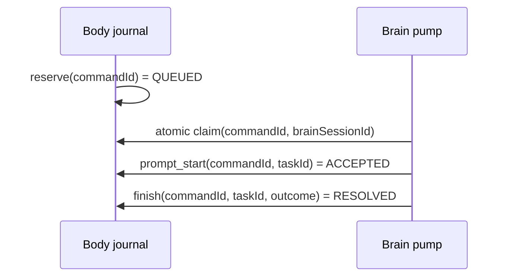

# 07 · 接口规格说明书（IPC 协议 v2）

> 文档定位：brain ↔ body 契约的**唯一权威定义**。实现侧镜像文件：brain `src/ipc/types.ts`、body `common/src/main/kotlin/com/superagent/common/Protocol.kt`。任何一侧改接口，先改本文并升版。
> protocolVersion = **2**（v1 为脚手架期隐式版本，已废弃）
>
> 当前校准：2026-08-21。本文描述当前 40 个 body RPC；完成度与已知缺口以 [docs/16](16-当前架构代码审计-2026-08-21.md) 为准。

## 1. 传输与通用约定

| 项 | 规格 |
|---|---|
| 绑定 | body 当前监听 `0.0.0.0:8765`；同机 Termux/adb forward 通常访问 `127.0.0.1:8765`。安全边界依赖 Bearer token，不应把监听地址误当鉴权 |
| 鉴权 | 每请求 `Authorization: Bearer <token>`；token 为 body 首启生成的 256bit 随机串（filesDir/token）；失败一律 `401` + `UNAUTHORIZED` |
| 编码 | UTF-8 JSON；`Content-Type: application/json; charset=utf-8` |
| 超时 | brain 客户端默认 35s（health 3s；events 5s）；body handler 默认 30s；长耗时方法分层见 §2.6（hitl 75s/语音 60s/skill.run 120s，brain 侧 90s/75s/150s） |
| 幂等 | 写操作带 `idempotencyKey`；body 缓存 512 条（FIFO），按 bootId 隔离；**仅缓存成功结果** |
| 版本 | brain 启动时 GET /health 校验 `protocolVersion`，不等 → 拒绝启动并报 `PROTOCOL_MISMATCH` 方向 |

### 1.1 端点

| 端点 | 方法 | 用途 |
|---|---|---|
| `/rpc` | POST | JSON-RPC：`{id:int, method:string, params:object?, idempotencyKey?:string}` |
| `/health` | GET | 健康与能力探测 |
| `/events?since=<seq>` | GET | 短轮询事件（seq 递增，返回 seq>since 的事件） |
| `/blob/{id}` | GET | 二进制通道（截图，Bearer 鉴权；id 纯文件名防穿越；**2026-08-19 落地**——vision 感知截图 JPEG，brain 取图送 VLM；POST 仍预留） |

### 1.2 响应包络

```
成功: {"id":<reqId>, "ok":true,  "result":<Any>}
失败: {"id":<reqId>, "ok":false, "error":{"code":<string>, "message":<string>, "reason"?:<string>}}
```

### 1.3 错误码表（全量 19：body 侧 18 + brain 侧 1 预留）

> 2026-08-19 全量比对修正：以 `BodyServer.kt`/`BodyCore.kt` 实际 `RpcResponse.failure` 为准，补 INTERNAL/AUDIO_ROUTE/SENSOR/SKILL_LEARN，BLOB_UNSUPPORTED 从"预留"改为实际占位返回。

| code | HTTP | 含义 | brain 侧处置建议 |
|---|---|---|---|
| UNAUTHORIZED | 401 | token 无效/缺失 | 检查 BODY_TOKEN，提示重新桥接 |
| BAD_REQUEST | 400 | JSON 解析失败 | 修 brain 序列化，属 bug |
| REQUEST_TOO_LARGE | 413 | 请求体缺失或超过 10MB 上限（审计 P1-04） | 拆分请求，属 bug |
| BAD_PARAMS | 200 | 方法参数缺失/类型错 | 修工具 schema，属 bug |
| UNKNOWN_METHOD | 200 | 方法名不存在 | 检查协议版本 |
| METHOD_NOT_ALLOWED | 405 | 非 GET/POST | 属 bug |
| NOT_FOUND | 404 | GET 路径不存在 | 属 bug |
| INTERNAL | 500 | body HTTP 层未捕获异常（serve 兜底） | 读 message 上报，属 bug |
| BODY_ERROR | 200 | handler 内部异常 | 读 message 判定重试/上报 |
| TIMEOUT | 200 | handler 超时（默认 30s；hitl 75s/语音 60s/skill.run 120s，按方法注册） | 可安全重试（幂等键不变；**注意：超时后原执行可能仍在后台进行**——不可取消动作（手势/HITL）结果未知，带幂等键重试将共享原执行） |
| VISION_BLOCKED | 200 | 敏感会话内 perceive(vision)（reason="privacy"，审计 P1-06：截图不出设备） | 回退 a11y 模式感知 |
| **COMMIT_BOUNDARY** | 200 | 提交边界拦截（v1 名 PAYMENT_RED_LINE，**v2 更名**）。reason 两值：`commit` = 提交边界词硬拦截（body 侧 select 兜底）；`sensitive_session` = 敏感会话内确认动作需人工确认 | `commit` → 转 hitl.handoff，绝不重试；`sensitive_session` → hitl.confirm 带 `action` 放行一次后重试 |
| A11Y_DISCONNECTED | 200 | 无障碍服务未连接（reason="a11y"） | 通知用户开启，勿判白屏 |
| SPEECH_UNAVAILABLE | 200 | 语音模型未安装（reason="model"） | 提示 fetch-models，降级文字交互 |
| AUDIO_ROUTE | 200 | 音频路由失败（耳机未插、无效 target 等） | 读 message，改用当前路由 |
| SENSOR | 200 | 传感器读取失败/未知类型 | 检查 type 参数 |
| SKILL_NOT_FOUND | 200 | 技能名不存在（skill.run / skill.feedback） | 改现场规划 |
| SKILL_STALE | 200 | 回放失配（reason="stale"，附已完成步骤上下文） | 进 recovery mode 续走 |
| SKILL_LEARN | 200 | 技能固化失败（空轨迹等） | 修 trace 数据后重试 |
| BLOB_UNSUPPORTED | 200 | blob 方法或方向不支持；当前 `GET /blob/{id}` 已支持截图读取，POST 仍未实现 | 改用已支持的 GET，或等待上传能力 |
| PROTOCOL_MISMATCH | —（brain 本地） | protocolVersion 不符，brain 健康检查拒绝继续 | 提示升级另一侧 |

## 2. RPC 方法全量规格

坐标约定：**像素坐标**（与 perceive.screen 的 bounds/center 同单位；P0 真机验证修正：body 侧不再做 0–999 归一化换算）。`near` 为同文多匹配时就近消歧参考点。

### 2.1 感知

#### perceive.screen
| | |
|---|---|
| params | `{mode?: "auto"\|"a11y"\|"vision"\|"ocr"}`（默认 auto；a11y 已实现，vision/auto 为部分完成，ocr 当前回退） |
| result | `ScreenResult`（下） |
| errors | A11Y_DISCONNECTED；VISION_BLOCKED |

```
ScreenResult {
  signature: string          // 屏幕内容稳定哈希（marks 文本+坐标 SHA1 前 12 位）
  kind: "a11y"|"vision"|"ocr"
  blank: boolean             // 无可读内容
  nodes?: A11yNode[]         // {label, clickable, selected?, sensitive?, bounds{left,top,right,bottom}}
  marks?:  Mark[]            // {index, text, center{x,y}}  — 可点目标索引
  pageTexts?: string[]       // 全部可见文本（证据核验用）
  appPackage?: string
  sensitiveSession?: boolean // 当前是否处于敏感会话（body 侧敏感App注册表匹配）
  screenshotRef?: string     // 视觉感知（L1）截图引用：GET /blob/{ref} 取 JPEG（brain 送 VLM 识别 marks）；
                             // mode=vision 且已授权屏幕捕获时返回，未授权回退 a11y
  screenWidth?: int          // 截图当时真实屏幕宽度
  screenHeight?: int         // 截图当时真实屏幕高度
  screenshotWidth?: int      // JPEG 实际宽度
  screenshotHeight?: int     // JPEG 实际高度
  visionFallback?: "provider_unavailable"|"invalid_output"|"invalid_coordinates"|"missing_dimensions"
}
```

`screen*`/`screenshot*` 只在成功截图时出现，brain 必须用 X/Y 独立比例换算并在截图、屏幕两个边界内校验。`visionFallback` 出现时 `kind` 必须是 `a11y`，`screenshotRef` 必须移除；调用方不得将其展示为视觉识别成功。

| VLM 结果 | 返回语义 | 是否可使用 VLM 坐标 |
|---|---|---|
| success | `kind=vision`，marks 按真实尺寸换算 | 是 |
| provider_unavailable | fresh a11y + typed fallback | 否 |
| invalid_output | fresh a11y + typed fallback | 否 |
| invalid_coordinates | fresh a11y + typed fallback | 否 |
| missing_dimensions | fresh a11y + typed fallback | 否 |

当前 MediaProjection attach、WebView 结构化信号和 C-02 敏感前台双刷新门禁已闭环；真机视觉坐标标定仍属设备验收项。

### 2.2 操控（9 个）

| method | params | result(ActionResult) | errors |
|---|---|---|---|
| control.tap | `{x:int, y:int}` | `{located, signature?}`；未命中→located=false | — |
| control.longPress | `{x, y, durationMs?=600}` | 同上 | — |
| control.swipe | `{fromX, fromY, toX, toY, durationMs?=300}` | 同上 | — |
| control.typeText | `{text:string}` | located=存在可用输入框且 SET_TEXT 成功 | — |
| control.selectOption | `{label:string, near?:{x,y}}` | located=找到并点击 | **COMMIT_BOUNDARY** |
| control.selectSpec | 同上 | 同上 + 选中态校验（前后帧签名变化，无变化→located=false） | **COMMIT_BOUNDARY** |
| control.back | `{}` | `{located}` | — |
| control.home | `{}` | `{located}` | — |
| control.launch | `{pkg:string}` | located=启动成功；包不存在 message 注明 | — |

安全不变量：任何最终坐标手势都应经过 `ActionGate.checkCoordinate`。selectOption 内部 tap 旁路已修复（docs/16 C-01，GPT typed gate 批次）——两条选择分支共用「最终坐标闸门 → tap」路径并以 typed Violation 传递；本表示目标契约，实现路径已对齐（真机回归清单待设备批次）。

### 2.3 语音（8 个）

| method | params | result | errors |
|---|---|---|---|
| speech.asr | `{}` | `{text, confidence, durationMs}`（静音 1.2s 断句） | SPEECH_UNAVAILABLE；TIMEOUT（body 60s / brain 客户端 75s） |
| speech.say | `{text, voice?: VoiceConfig}` | `{route:"speaker"}` | SPEECH_UNAVAILABLE |
| speech.interrupt | `{}` | `{}`（空对象） | — |
| speech.playBytes | `{audio:string}`（base64，512B–5MB） | 播放结果 | BAD_PARAMS |
| speech.playFile | `{file:string}`（filesDir 内 basename） | `{route:"speaker"}` | BAD_PARAMS；NOT_FOUND |
| speech.status | `{}` | `{sherpaReady,systemTtsReady,activeEngine}` | — |
| speech.voiceprintEnroll | `{name:string, samples?:int=3}` | `{speaker, samples}` | SPEECH_UNAVAILABLE；TIMEOUT（body 60s / brain 客户端 75s） |
| speech.voiceprintIdentify | `{}` | `{speaker?:string, confidence}`（未识别 speaker=null） | SPEECH_UNAVAILABLE；TIMEOUT（body 60s / brain 客户端 75s） |

KWS 与 VAD/barge-in 事件仍属 P1，不是当前 RPC 方法；异步语音事件走 `/events`。

```
VoiceConfig（对齐 Clowder 契约子集）{
  speakerId?: int = 0        // Kokoro 多音色
  speed?: float = 1.0
  refAudio?: string          // ZipVoice 克隆参考（P2 预留）
  refText?: string
  instruct?: string
  temperature?: float = 0.7
}
```

### 2.4 硬件（4 个）

| method | params | result | errors |
|---|---|---|---|
| hardware.audioRoute | `{target:"auto"\|"earpiece"\|"speaker"\|"headset"}` | `{route}`；耳机未插→AUDIO_ROUTE | AUDIO_ROUTE |
| hardware.vibrate | `{pattern:int[](ms), repeat?:int=-1}` | `{}` | — |
| hardware.sensor | `{type:"proximity"\|"light"\|"step"\|"motion"}` | `{type, value:double, timestamp}` | SENSOR（未知类型/读取失败） |
| hardware.headset | `{}` | `{connected, type:"wired"\|"bluetooth"\|"none"}` | — |

### 2.5 技能（5 个）

| method | params | result | errors |
|---|---|---|---|
| skill.list | `{}` | `{skills:[{name,description,appPackage,tags}]}`（排序：verified>active>candidate，deprecated 不默认返回） | — |
| skill.search | `{query:string}` | `{hits:[{skill:SkillMeta, score:double}]}`（中文 2-gram TF-IDF，阈值 0.30，按分降序） | — |
| skill.run | `{name:string, args?:map<string,string>}` | `{result:"success"\|"stale"\|"sensitive_handoff", completedSteps:int}` | SKILL_NOT_FOUND；stale 时 error.message 附已完成步骤 JSON（recovery 上下文）→ **SKILL_STALE**；TIMEOUT（body 120s / brain 客户端 150s） |
| skill.learn | `{goal, appPackage, trace:[TraceStep]}` | `{slug:"skill-<pkg>-<goal8>"}`（状态初始 candidate） | SKILL_LEARN（空轨迹等固化失败） |
| skill.feedback | `{name:string, success:boolean}` | `{}`（累计统计驱动状态机） | SKILL_NOT_FOUND |

```
TraceStep { tool:string, args?:map, located:boolean, signature?:string, timestamp:long, sensitive?:boolean, resultKind?:string }
```

### 2.6 人工接管（3 个）

| method | params | result | errors |
|---|---|---|---|
| hitl.confirm | `{prompt:string, action?:string}` | `{approved:boolean}`（60s 超时=false） | TIMEOUT（handler 内等用户 60s；body 75s / brain 客户端 90s） |
| hitl.ask | `{prompt:string}` | `{answer:string}`（RemoteInput 内联回复；60s 超时=""） | TIMEOUT（同上：body 75s / brain 90s） |
| hitl.handoff | `{reason:string}` | `{taken:boolean}` | TIMEOUT（同上：body 75s / brain 90s） |

- `hitl.confirm.action`（2026-08-19 增）：被 `COMMIT_BOUNDARY`(reason="sensitive_session") 拦截动作的确切文字。用户同意后 body 按标签放行一次（2 分钟时效，敏感会话切换即失效），模型可重试该动作——否则 `needsExtraConfirm` 会无限重拦形成死锁。
- 超时分层（2026-08-19 对齐）：HITL 等待 60s < body handler RPC 超时 75s < brain 客户端 90s；录音/声纹 body 60s / brain 75s；skill.run body 120s / brain 150s。不变量：brain 客户端超时 > body handler 超时 > handler 内部等待上限。


### 2.7 brain 事件回灌（1 个，UI-0 / CT-06）

> 当前实现契约如下。BR-10/CT-06 的跨重启 command ack 已冻结设计、尚未落地：后续兼容增加可选 `sourceSessionId/commandId`，并以 Body 持久 command journal 校验 `commandId → taskId` 唯一映射；在此之前，EventBus 发布不能解释为 Brain accepted。

#### brain.event
| | |
|---|---|
| params | `BrainEvent`（类型化封闭契约，contract.json 真源） |
| result | `{}` |
| errors | BAD_PARAMS |

```
BrainEvent {
  taskId: string          // 任务隔离（含 boot-session ID，brain 重启安全）
  seq: number             // 单调递增（UI 去重/排序）
  state: string           // 有限枚举：prompt_start/act/act_done/hitl_wait/blocked/finish/error/heartbeat
  stepIndex?: number      // 已发生步骤序号
  displayText: string     // 已脱敏用户可读（≤40 字），禁坐标/工具名/JSON
  requiresUser: string    // none/control/confirm/handoff
  resultKind?: string     // finish 必填：success/failed/aborted/paused/unknown_side_effect
  timestamp: number
}
```

目标回执顺序：



完整字段、崩溃语义与验收矩阵见 `docs/superpowers/specs/2026-08-21-command-ack-design.md`。

> AD-10 nonce：hitl.confirm 现支持 `nonce` 参数（body 侧一次性消费，绑原始动作+前台+120s）；
> COMMIT_BOUNDARY(sensitive_session) 错误的 `nonce` 字段携带 nonce（RPC 响应内）。

### 2.8 记忆（7 个）

| method | params | result | 说明 |
|---|---|---|---|
| memory.write | `{kind,topic,content,source?,confidence?}` | `MemoryWriteResult` | 新建、强化或替换同 topic 记忆；PII 拒绝 |
| memory.search | `{query,limit?}` | `MemorySearchResult` | 2-gram/关键词检索并增加命中计数 |
| memory.revise | `{id,content}` | `{revised:boolean}` | 修订已有记忆；当前 PII 校验缺失（docs/16 C-09） |
| memory.forget | `{id}` | `{forgotten:boolean}` | 用户明确要求时物理删除 |
| memory.export | `{}` | `MemoryEntry[]` | 导出 active + revoked 全量快照 |
| memory.import | `{entries}` | `MemoryImportResult` | 补缺导入，不覆盖现有、不复活 revoked |
| memory.maintain | `{}` | `{decayed,archived}` | 月度衰减与 active>500 容量治理；当前工作树新增，专项测试待补 |

### 2.9 run 归档（2 个）

| method | params | result | 说明 |
|---|---|---|---|
| run.archive | `{id,goal,startedAt,finishedAt,outcome,failureReason?,traceJson}` | `{archived:true}` | SQLite 全量归档；wrapper 单写 + 幂等门；`stopped` 为不可续用户停止终态 |
| run.list | `{limit?}` | `RunArchive[]` | 按时间倒序读取，默认 30 条 |

### 2.10 任务收尾（brain 内部工具，不产生 body RPC）

task.finish `{summary, evidence}`：brain 内部重新 perceive.screen → 证据闸门（存在性+新颖性+长度）→ 通过则自动 skill.learn。

## 3. /health 返回

```
{ ok:true, bootId:"body-<ts>", protocolVersion:2, uptimeMs:long,
  services:{a11y:bool, asr:bool, tts:bool, speaker:bool, kws:bool(P1)} }
```
services 值 = 该能力模型/服务当前真实可用性（模型未装=false）。

## 4. 事件流（/events）

```
BodyEvent { seq:long↑, type:"state"|"hitl"|"voice"|"sensor"|"log", payload:object? }
```
- 当前 `seq` 仅为 Body 进程内水位，重启后可能归零，不能作为稳定 commandId。
- 目标契约增加 Body `sourceSessionId` 并把 EventBus 降为 wake hint；耐久命令从 command journal 领取。
- state：屏幕签名变化（brain 免轮询感知变化）
- hitl：用户应答结果回放
- voice：VAD/barge-in/KWS 事件（P1）
- sensor：耳机插拔等异步硬件事件
- log：skill.learn 等审计事件

## 5. 持久化数据格式（body 侧，属契约的一部分）

### 5.1 技能文件 `filesDir/skills/<slug>.json`（v2）

```
StoredSkill {
  name, description, appPackage, tags:[string],
  state:"candidate"|"verified"|"active"|"deprecated",
  stats:{ runCount:int, successCount:int, staleCount:int },
  steps:[ { tool, args:map<string,string>, expectedSignature?:string } ]
}
```

### 5.2 词表单一来源 `common/src/main/resources/commit_boundaries.json`（WP1 新增）

```
CommitBoundaries {
  commitPhrases: [string],            // 提交边界词（不可逆动作，硬拦截）
  sensitiveNavPhrases: [string],      // 敏感导航词（标记但不拦截）
  sensitiveSessionActionVerbs: [string], // 敏感会话内额外确认词
  sensitiveUrlPatterns: [string],     // WebView URL 敏感特征
  sensitiveAppPrefixes: [string],     // 敏感App包名前缀
}
```

brain 侧 `commitBoundary.ts` 从同源 JSON 读取（路径 `body/common/src/main/resources/commit_boundaries.json`），确保双侧词表一致性。加载失败时 fallback 到硬编码默认值。

### 5.3 其他

| 文件 | 格式 |
|---|---|
| filesDir/token | 纯文本 64 hex 字符 |
| filesDir/speaker-embeddings/embeddings.json | `{name: [[float,...],...]}` |
| brain personas.json | `{active:string, personas:{<name>:{name,description,voice:VoiceConfig,prompt}}}` |
| brain session 落盘 | runState{goal, baselineScreen, trace[], outcome?, failureReason?}（AD-05：自实现，参照 Kestrel RunTraceBuilder 失败留痕+脱敏；不用 pi AgentHarness） |

## 6. 变更记录

| 版本 | 日期 | 变更 |
|---|---|---|
| v1（隐式） | 2026-08-18 | 脚手架期：brain types.ts / body Protocol.kt 首版 |
| **v2** | 2026-08-18 | protocolVersion 字段引入；PAYMENT_RED_LINE→COMMIT_BOUNDARY；+SKILL_STALE/A11Y_DISCONNECTED/PROTOCOL_MISMATCH/BLOB_UNSUPPORTED；skill.feedback；/blob 定稿；StoredSkill v2（state/stats/expectedSignature） |
| **v2.1** | 2026-08-18 | WP1：ScreenResult 新增 sensitiveSession 字段；词表单一来源 commit_boundaries.json（§5.2）；敏感App注册表+WebView URL检测+敏感会话退出机制；HITL confirm 通知聚合（CompletableDeferred+CAS） |
| **v2.2** | 2026-08-19 | AD-05 架构纠正：① skill.search RPC 新增（检索下沉 body，中文 2-gram TF-IDF）② TraceStep 新增 sensitive/resultKind 字段 ③ brain 不再持有词表（commitBoundary.ts 删除）④ pi 只用核心 Loop（Agent+pi-ai），不用 AgentHarness/Session/JsonlSessionRepo ⑤ brain 新增 ReActGuard 止损 + FinishEvidence 新颖性核验（参照 Kestrel） |
| **v2.3** | 2026-08-21 | 按当前代码校准：补 memory 7 个、run 2 个 RPC；更新语音、监听、blob、视觉链与安全实现边界；总计 40 个 body RPC |
