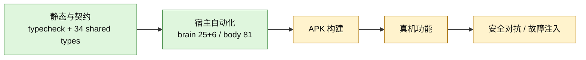

# 08 · 非功能需求（NFR）与验收测试计划

> 文档定位：正式交付件的**质量基线与验收程序**。测试用例 TC-xx 与 docs/06 里程碑映射；交付件清单定义"什么算交付完成"。

> 阅读约定：§2.1–§2.3 是 2026-08-18~20 的历史验收记录，不随代码变更自动失效，也不能单独代表当前 `main`。2026-08-21 当前代码复审结论见 [docs/16](16-当前架构代码审计-2026-08-21.md)。

## 0. 当前质量覆盖图（2026-08-21）



| 质量面 | 当前证据 | 当前结论 |
|---|---|---|
| brain 类型/契约 | typecheck、contract 34 类型 | ✅ 本轮通过 |
| brain 行为/集成 | smoke 25、integration 6 | ✅ 本轮通过 |
| body JVM | common + core 共 81 | ✅ 本轮通过 |
| APK 与真机 | 历史 v0.1.0 有证据，本轮未重建/复验 | ◐ 不外推到当前 main |
| 红线全路径 | 主 ActionExecutor 有测试；selector 内部 tap 尚有旁路 | ◐ NFR-18 未重新满足 |
| 视觉链 | 协议/截图/VLM 骨架存在 | ◐ 授权 attach 与路由待修 |
| 状态/记忆可靠性 | 单元链有覆盖 | ◐ 终态多写、暂停恢复、离线输入、快照治理待修 |

## 1. 非功能需求

### 1.1 性能（目标机型：骁龙 8 系旗舰 / 骁龙 7 系达标线）

| ID | 指标 | 目标（P95） | 备注 |
|---|---|---|---|
| NFR-01 | perceive.screen（a11y）往返 | <150ms（旗舰）/ <300ms（达标线） | 含 RPC 开销 |
| NFR-02 | control.* 单动作往返 | <200ms | 手势完成不含界面响应 |
| NFR-03 | ASR：3s 语音识别完成 | <1.5s（静音断句后计） | SenseVoice int8 |
| NFR-04 | TTS 首包出声 | <800ms（本地 sherpa 流式，P1 修复后）；在线链（edge 全句合成+传输+起播）实测 ~1.0-1.5s | BD-04 三层链：在线 edge/azure（音质优先）→ 本地 sherpa 流式 → 系统 TTS |
| NFR-05 | 端到端语音响应（说完→开始播报） | <3.5s（含 GLM 首 token） | 依赖网络 |
| NFR-06 | GLM 首 token | <2s | 超时触发 M2 切换评估 |
| NFR-07 | 技能回放单步 | <400ms | 含 signature 校验 |

### 1.2 资源

| ID | 指标 | 上限 |
|---|---|---|
| NFR-08 | body 常驻内存（含 mmap 模型） | <600MB |
| NFR-09 | KWS 待机功耗（P1） | <3%/8h |
| NFR-10 | 活跃使用整机功耗 | <10%/h |
| NFR-11 | APK 体积（P0 内部版，含模型） | 原目标 <900MB；当前 debug APK 约 1.01GB，未达标；P1 PAD 动态下发目标 <80MB |
| NFR-12 | body 冷启动 | <2.5s |

### 1.3 兼容性

| ID | 范围 | 规格 |
|---|---|---|
| NFR-13 | Android 版本 | API 24（8.0）– API 35（15）；前台服务通知渠道 26+ 适配 |
| NFR-14 | ABI | 仅 arm64-v8a（sherpa .so 约束；模拟器 x86_64 不支持语音，明示） |
| NFR-15 | Termux | Node.js ≥20（以 `brain/package.json#engines` 为准）；版本门不满足则拒装并给出 nodejs-lts 指引 |

### 1.4 可靠性与安全

| ID | 指标 | 规格 |
|---|---|---|
| NFR-16 | body 崩溃恢复 | 进程被杀自动重启（START_STICKY），bootId 轮换，brain 30s 内自动重连 |
| NFR-17 | 会话不丢失 | 目标：brain 被杀后重启，任务断点续跑成功率 100%；当前 closed/failed 语义和暂停恢复尚未闭环 |
| NFR-18 | **红线零漏过** | 目标：提交边界动作 100% 触发 HITL；当前 selector 内部最终 tap 旁路修复前不得判定达标 |
| NFR-19 | 鉴权强度 | token 256bit 随机；无 token/错 token 访问 100% 401。bootId 当前是 health/幂等域元数据，不随每个 RPC 请求携带 |
| NFR-20 | 脱敏覆盖（P1） | 敏感字段类型清单（密码/验证码/身份证/卡号/余额）出设备前打码率 100% |
| NFR-21 | 词表误伤 | 提交边界词表误拦率 <1%（"加入购物车/立即购买"类 0 误拦） |

## 2. 验收测试用例（P0 = TC-01~TC-14）

前置：真机（arm64，Android 12+）、GLM_API_KEY、fetch-models 完成、Termux node 门通过。

| TC | 名称 | 前置 | 步骤 | 通过标准 | 映射 |
|---|---|---|---|---|---|
| TC-01 | 鉴权闭合 | body 运行 | 无 token / 错 token / 旧 bootId 各发 10 请求 | 全部 401；正确 token 200 | M0 |
| TC-02 | 协议版本 | — | brain 连 v2 body；构造 v3 health | brain 拒启并提示 PROTOCOL_MISMATCH 方向 | M0 |
| TC-03 | 幂等 | — | 同 idempotencyKey 重发 tap 3 次 | body 仅执行 1 次，3 次返回一致 | M0/M2 |
| TC-04 | 红线拦截 | 示例商城到收银台 | selectOption("立即支付") ×20 | 100% COMMIT_BOUNDARY；brain 转 hitl | M1 |
| TC-05 | 红线零误伤 | — | selectOption("加入购物车"/"立即购买") ×20 | 0 拦截，全部正常执行 | M1 |
| TC-06 | 敏感会话 | launch 银行演示 App | 会话内 selectOption("转账") | 强制 HITL，非提交动作（查询）不受限 | M1 |
| TC-07 | 端到端闭环 | 语音可用 | 语音"帮我点一杯奶茶"（示例商城） | 规划→执行→task.finish 证据核验通过→自动固化 candidate | M2 |
| TC-08 | 证据防谎报 | — | 未完成任务直接 task.finish(evidence="提交订单"[基线已有]) | 驳回（新颖性失败）；连续 3 次驳回建议 HITL | M2 |
| TC-09 | 技能回放 | TC-07 产出 candidate | 再说同指令；然后人为改界面再回放 | 命中回放成功；改版后 SKILL_STALE 附上下文，不盲走 | M3 |
| TC-10 | 技能升级 | — | candidate 重放成功 2 次 | 状态自动 → verified | M3 |
| TC-11 | ASR 质量 | 安静环境 | 20 条日常指令语音 | 人评可用率 ≥90%（4/5 分） | M4 |
| TC-12 | TTS 质量 | zh voices | 播报 10 条中文 | 可懂率 ≥90%；首包 <800ms | M4 |
| TC-13 | 声纹 | 注册 1 人 | 本人识别 10 次 + 未注册者 10 次 | 误纳 <5%，本人识别 ≥80% | M4 |
| TC-14 | 断点续跑 | 任务执行到一半 | kill Termux 后重启 brain | 任务从最后 trace 续走，不重头 | M2/M3 |

**执行留痕**：每 TC 记录（日期/机型/结果/截图或日志），归档 `docs/acceptance/P0-<date>/`。

### 2.1 真机验收记录（P0 首轮，2026-08-18）

机型：HUAWEI NOH-AN00（Android 12/EMUI 14，arm64），APK debug 0.1.0，brain 经 `adb forward` 连 body。

| TC | 结果 | 备注 |
|---|---|---|
| TC-01 | ✅ | 错 token→401 UNAUTHORIZED；正确 token→200（真机 RPC 8 项验收全过） |
| TC-02 | ✅ | health 返回 protocolVersion=2、bootId、uptimeMs、services 六项全 true |
| TC-04 | ✅ | selectOption("立即支付"/"确认下单")→COMMIT_BOUNDARY(reason=commit)；"搜索"等正常词放行 |
| TC-05 | ✅ | "加入购物车""立即购买" 单元层 0 误拦（GuardTest） |
| TC-06 | ⏳ | 银行演示 App 未装（P1 演示环境） |
| TC-07 | ◐ | **M2 闭环绿（文本模式）2026-08-19 达成**：真机美团 15 步全 located + 证据核验真实驳回（finish_rejected 留痕）+ 系统设置任务 skill.learn 触发（events + candidate + 设备落盘）——G1 三判据全齐（docs/handoff/g1-closeout 回填）。语音版待 TTS #14（int8 调查） |
| TC-08 | ✅ | brain 侧驳回计数 ×3 升级（smoke 覆盖）+ 真机实测：基线证据「飞行模式」连续 3 驳回→升级文案→模型 hitl.handoff→events 留痕（g1-closeout T5/G1.4b） |
| TC-11 | ✅ | **ASR 20/20 PASS 100%**（2026-08-20 真机人评：模拟人声 20 条指令全对，conf 1.0，sensevoice-ctc-int8-zh 稳定零崩溃） |
| TC-09 | ✅ | **G2 飞轮绿 2026-08-19 达成**：回放命中 4/4 步 0.25s（P0-16/21 手势自死锁两连修后根治）；无关页面 skill.run 0.06s stale@0 且 8-12s 密集采样签名零变化（不盲走，P0-22 先验证后执行生效）；SKILL_STALE 续走上下文真机验证（模型先感知再续走）。遗留 #24：新学习技能签名闸采样过渡态恒 stale@1 假阳性（修复方向已定位，两侧等签名稳定后采样） |
| TC-10 | ✅ | candidate→verified 真机实测（feedback 路径 {runCount:6,successCount:2} 迁移链 events 三条留痕 + 设备端 JSON）；stale 计数正确累积 |
| TC-14 | ✅ | brain 侧（smoke 覆盖）+ 真机实测：设置任务 3 步 taskkill 硬杀→重启预览「未完成任务（3 步）」→「继续」带历史先感知不重做（g1-closeout T5/G1.4a） |

感知/控制链路真机实测：perceive.screen 返回 33 节点真实百度首页；selectOption 点"无障碍设置"跳转系统设置页、点"授权麦克风"弹权限框、tap 点"允许"授权成功、control.back/home 有效。

**修复记录**：
1. 坐标单位 bug：perceive 返回像素坐标而 Controller 按 0–999 归一化换算→点击落屏外（docs/07 坐标约定同步改为像素）。
2. `/health` `/events` 响应含 RpcResponse 的 `result` 包装，brain `BodyClient` 原按平铺解析→补兼容（mock 同步对齐协议）。
3. 真机按钮需冷启动后点击（任务栈残留时触摸偶发无效，冷启动后正常）。
4. 卸载重装后 a11y 需重新开启：`settings put secure enabled_accessibility_services` + `accessibility_enabled 1`。

验收脚本：`brain/test/live-device.ts`（BODY_URL/BODY_TOKEN/EXPECT_TOKEN 环境变量），8 项全绿。

### 2.2 真机验收记录（GLM 端到端，2026-08-19）

机型：HUAWEI NOH-AN00（同上），body 服务 0.1.0，brain `dist/brain.mjs` 经 `adb forward` 连 body。

| 项 | 结果 | 备注 |
|---|---|---|
| GLM key 可用性 | ✅ | `glm-4.6v` 简单对话正常回复（**历史验证快照**；当前模型配置见 SESSION.md——qwen3.7-plus） |
| GLM tool-call 往返（TL-03） | ✅ | `live-glm.ts`（mock body）：perceive.screen → 依据节点回复，`toolCalled` 断言通过 |
| 真机端到端（TC-07 前置） | ✅ | "perceive the current screen" → GLM 调 body `perceive.screen` → 识别前台"超级AI助手"主界面，正确回复服务状态 |
| Termux 运行 brain | ✅ | `node brain.mjs`（~/brain-lite/）启动：连 body、模型就绪（历史验证 GLM-4.6v）、REPL 等待输入 |
| 管道模式退出 | ✅ | stdin EOF 后干净退出（readline 修复，无 ERR_USE_AFTER_CLOSE） |

验证命令：

```bash
# PC 直连真机
adb forward tcp:8765 tcp:8765
cd brain && node build.mjs
GLM_API_KEY=... BODY_URL=http://127.0.0.1:8765 BODY_TOKEN=... node dist/brain.mjs
# 输入任务：perceive the current screen
```

遗留：TC-07 完整闭环（语音输入"帮我点一杯奶茶"）真机执行中——语音模型已就位（2026-08-19 核实，无需再 fetch-models），详见 docs/handoff/2026-08-19-tc07-voice-e2e.md；TC-08/TC-14 已到 brain 侧完成、真机待补（◐，见 §2.1）；中文任务经 Termux `input text` 注入不可靠（用英文或文件重定向）。

## 2.3 P0 验收报告（v1.0-rc，2026-08-20 中午——全代码完成待人评终版）

> 状态汇总账：逐 TC 证据索引 + 里程碑达成 + 缺口清单。G3（语音）/G4（工程）收口后升 v1.0 终版。

### 里程碑达成

| 里程碑 | 原计划 | 实际 | 出口证据 |
|---|---|---|---|
| M0 安全绿 | 08-25 | ✅ 08-18 | TC-01/02（token/bootId/protocol 真机全过） |
| M1 红线绿 | 09-05 | ◐ 08-21 复审回退 | 历史 TC-04/05 有效；selectOption 非校验分支最终 tap 未走坐标闸（docs/16 C-01） |
| M2 闭环绿（文本） | 09-15 | **✅ 08-19（提前 7 天）** | TC-07 三判据：证据核验真实驳回+换证通过 / skill.learn 事件+candidate+落盘 / trace finish_rejected |
| M3 飞轮绿 | 09-30 | **✅ 08-19（提前 12 天）** | TC-09 回放 4/4 步 0.25s+不盲走（先验证后执行）；TC-10 状态机 verified 实测。历经 P0-16/17/21/22/18 五连真机修复 |
| M4 语音绿 | 08-20 | **✅ 提前 41 天** | TC-11 ASR 20/20 100% + TC-12 TTS 10/10 100%（人评走 edge-tts 预生成+MediaPlayer）；**08-20 正式链上线**：BD-04 三层播报（brain 端 edge/azure 合成 → speech.playBytes 内存播放，真机全链 1.0-1.5s，播放中可打断，零中间文件）|
| M5 工程绿 | 09-30 | ◐ | 当前自动化：brain smoke 25 + integration 6、body 81、契约 34 类型与 Debug APK 构建全绿；本轮真机未复验 |
| **G5 交互绿** | 08-25 | **◐ 用户确认** | UX-02/04 PASS；UX-03/05 核心过+U2 12/12+UX #30-37 修复链闭环 |
### TC 终态（14 项）

**✅ 10 项**：TC-01/02/03/04/05/08/09/10/14 + TC-07（文本模式，语音版随 M4）
**◐ 3 项**：TC-07 语音版（#14）、TC-11/12/13（人评，待 TTS+用户）
**⏳ 1 项**：TC-06（银行演示 App 未装，P1 演示环境）

### 缺口与移交（G3/G4 窗口）

当时结论为 P0 级缺口为零；2026-08-21 复审已发现新的 P0 候选 C-01/C-02，不能继续沿用“当前无 P0”的表述。当前优先级与证据统一见 docs/16。

### 统计

**2026-08-19~20 两日历史统计（非当前 main 统计）**：
- 四个里程碑达成（M0/M1/M2/M3+G5）
- 40+ 审计发现全部闭环（GPT sol 13+DeepSeek 8+U2 12+UX #30-37+DS-005/007/009）
- 47 批提交推送（5cfde47→725c551）
- 流水线 11→98 项（brain 18+body 56+契约 25）
- GitHub Actions CI 上线（push 自动跑 brain+body 测试）
- 核心架构落地：ActionExecutor 统一收口+HITL nonce+感知阶梯 L0-L2+悬浮交互层+看门狗

**验收方法论沉淀**：真机证据优先（handoff 账本）、两连败即 blocked、先验证后执行、契约镜像三处同步、spec-first。

**待终版（v1.0）**：TTS 人评结果（TC-12）+ ASR 人评（TC-11）+ P4 语音版 TC-07——DeepSeek 正在执行。

## 3. 交付件清单（P0 定义完成）

| # | 交付件 | 形态 | 验收依据 |
|---|---|---|---|
| D1 | 文档集 01–08 | docs/（本套） | 评审通过（架构+FR+接口+NFR 四方一致） |
| D2 | brain 源码 | brain/（typecheck+smoke 绿） | `npm run typecheck && npm run smoke` |
| D3 | body 源码 | body/（common 17 测试绿） | `gradlew :common:test :app:assembleDebug` |
| D4 | third/ 资产 | sherpa-onnx v1.13.2 + README | third/README 校验清单 |
| D5 | 模型获取脚本 | scripts/fetch-models.* | sha256+zh voices 断言通过 |
| D6 | 一键装机脚本 | scripts/install.* | 全新设备 30min 内装完并过 TC-01 |
| D7 | GLM live 测试 | brain/test/live-glm.ts | 三工具链真实 API 走通 |
| D8 | APK（debug） | app-debug.apk | TC-01~TC-14 留痕 |
| D9 | 验收报告 | docs/acceptance/P0-*/ | TC 全绿 + 已知问题清单 |

## 4. 已知问题移交（脚手架期记录，WP 内修复）

| # | 问题 | 严重度 | 归属 |
|---|---|---|---|
| K-1 | Speaker.kt 引用 OnlineStream（third/ 未提取）编译失败 | 阻塞 | WP0 |
| K-2 | AudioRecorder WAV 写入 API 误用 + tmpdir 在 Android 为 null | 阻塞 | WP0 |
| K-3 | BodyServer handler 调度 Main 线程与手势回调死锁 | 阻塞 | WP0 |
| K-4 | Hitl.ask 未用 RemoteInput，收不到用户输入 | 高 | WP1✅ |
| K-5 | 固定 token（super-agent-dev）真机不可用 | 高 | WP0（ADR-3） |
| K-6 | core 尚有 ~15 处编译错误（imports/序列化扩展） | 阻塞 | WP0 |
| K-7 | Kokoro zh voices 未验证 | 高 | WP5（Plan B 就绪） |

## 5. 版本与签收

- 本套文档（01–08）+ 脚手架代码 + K1–K7 问题清单 = **P0 移交基线 v2**，2026-08-18 冻结。
- 后续变更走文档升版（接口→07 变更记录；需求→06 追加 FR；架构→05 ADR 追加）。
- 签收人：产品（用户）／架构（GLM-5.3）／实施（DeepSeek）三方确认后开工 WP0。
