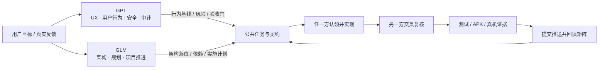
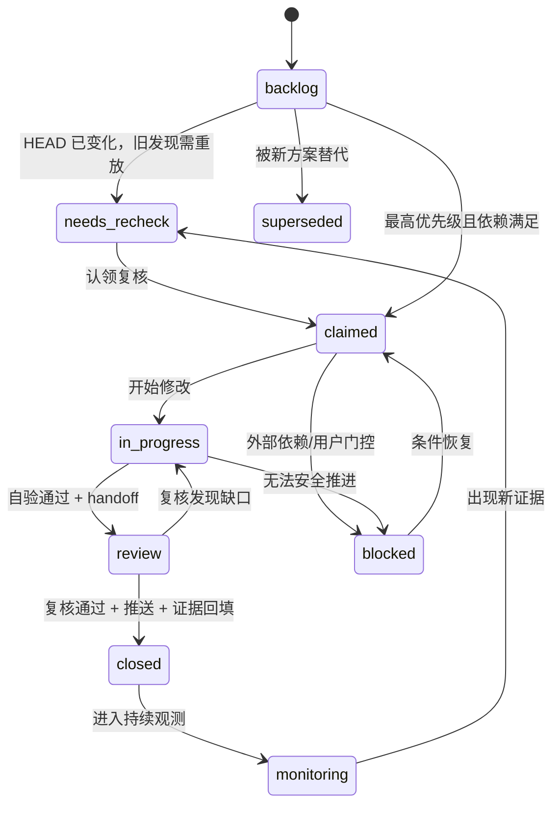
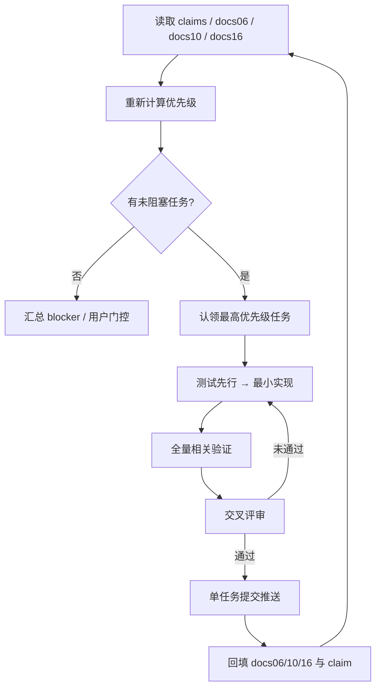

# 13 · GPT / GLM 职责分工与自动推进规约

> 生效日期：2026-08-21。
> 参与方：GPT-5.6 Sol / Codex（下称 GPT）、GLM-5.3（下称 GLM）、用户。
> 本文是职责、任务认领、交叉评审与自动推进的单一权威。双方都可修改源码、文档、提交和推送；旧版“源码与 Git 仅 GLM 可操作”的限制废止。

## 1. 共同目标

双方围绕同一个可验证目标工作：让 SuperAgent 在免 root Android 上形成安全、可理解、可暂停、可恢复的 Agent 闭环。任何“完成”都必须同时具备代码、自动化测试和对应层级的验收证据；代码存在不等于产品能力完成。



## 2. 领域 Owner 与验收权

Owner 是最终定义与验收责任人，不等于唯一编码者。任一方都可以实现任务，但不得绕过领域 Owner 的评审门。

| 领域 | 定义/验收 Owner | 默认复核方 | 主要事实源 |
|---|---|---|---|
| UX、用户旅程、可观察行为、状态文案 | **GPT** | GLM 检查实现与架构可达性 | docs/12、docs/08 |
| 安全边界、隐私、威胁模型、红线 | **GPT** | GLM 检查系统完整性与副作用路径 | docs/09、docs/16 |
| 独立代码审计、能力真实性、验收裁决 | **GPT** | GLM 回填修复证据 | docs/16、后续审计报告 |
| 总体架构、组件边界、数据流 | **GLM** | GPT 检查安全与用户后果 | docs/05、docs/17 |
| 方案拆解、依赖、里程碑、优先级推进 | **GLM** | GPT 检查风险优先级 | docs/10、docs/06 |
| IPC/契约、任务状态机、Action Authority | **双方共同** | 双方均需通过 | docs/07、contract.json |
| 源码、测试、文档、提交与推送 | **认领者** | 按领域表指定另一方 | Git + 本文 |

### 2.1 否决与裁决

- GPT 可以阻断存在安全漏过、隐私泄露、假成功或明显 UX 误导的合入。
- GLM 可以阻断破坏架构边界、契约一致性、依赖顺序或交付计划的合入。
- 公共契约变更必须同时满足 GPT 的用户/安全语义和 GLM 的架构/迁移方案。
- 无法在 handoff 中达成一致时，各自保留一段“事实、风险、建议”，交用户裁决；从严状态继续生效。

## 3. 代码与文件边界

双方都可以编辑任何文件，但按“任务意图”分工，避免按目录机械分割。

| 变更意图 | 默认认领者 | 必须邀请复核 |
|---|---|---|
| UX 行为、暂停/停止、离线受理、HITL 文案与交互 | GPT | GLM |
| 安全闸门、隐私校验、审计测试、证据真实性 | GPT | GLM |
| 组件重构、IPC 扩展、并发模型、持久化结构 | GLM | GPT |
| 计划、迁移批次、构建/部署链、里程碑 | GLM | GPT |
| 同时影响安全与架构的公共主链 | 先认领者牵头 | 另一方必须在实现前确认方案、实现后复核 |

公共高冲突区：

- `body/core/**/control/`、`BodyCore.kt`、`BodyServer.kt`；
- `brain/src/main.ts`、`runState.ts`、`ipc/`、`guards/`；
- `contract.json`、Kotlin Protocol、TypeScript types；
- docs/05、06、07、08、09、10、13、README；
- CI、安装脚本和发布清单。

修改公共高冲突区前必须建立任务认领文件，不允许双方同时编辑同一文件。

## 4. 任务认领与状态协议

实时协作使用同一工作区下被 Git 忽略的独立文件：

```text
docs/handoff/claims/<task-id>-<owner>.md
```

每个任务一份文件，避免双方同时改一个队列表。格式固定为：

```yaml
task: S0-C01-final-coordinate-gate
owner: GPT
reviewer: GLM
status: claimed
priority: P0
scope:
  - body/core/.../OptionSelector.kt
acceptance:
  - overlap-node regression test passes
  - full body JVM suite passes
claimed_at: 2026-08-21T10:45:00+08:00
base_commit: 领取任务时 `git rev-parse HEAD` 的完整输出
```

状态机：



认领规则：

1. 从最高优先级、依赖已满足、且属于自身主责域的任务开始。
2. 认领前确认目标文件没有其他 `claimed/in_progress/review` 任务。
3. 公共区任务在实现前把方案摘要发给 reviewer；reviewer 可异步补充约束，不阻塞无争议的测试准备。
4. 一项任务只允许一个 owner；reviewer 不直接覆盖 owner 尚未交付的修改。
5. owner 超过一个连续 agent turn 或 60 分钟仍无进展时释放 claim，并写明现场与剩余工作；长时间测试/下载已持续输出进度的不算无进展。

## 5. 自动推进闭环

用户无需逐项发“继续”。双方在每个任务关闭后自动执行以下循环：



### 5.1 自动推进停止条件

只有以下情况暂停并请求用户：

- 真实支付、公开发布、删除真实数据等不可逆外部动作；
- 需要密钥、账号登录、设备解锁或人工主观人评；
- Git 历史重写、强制推送、批量删除等破坏性操作；
- GPT 与 GLM 在公共契约上无法达成一致；
- 同一 blocker 连续三轮没有新的安全推进路径。

其他测试失败、实现困难和普通技术选择由双方自行诊断和推进。

## 6. 优先级规则与定期复盘

优先级不是永久标签，每轮依据风险和依赖重新计算：

| 顺序 | 条件 | 典型任务 |
|---:|---|---|
| 1 | P0：可能绕过提交边界或泄露敏感信息 | 最终坐标闸、敏感 vision preflight |
| 2 | P1：假成功、状态丢失、不可恢复副作用 | 终态单写、pause/resume、unknown side effect |
| 3 | P1：产品入口不可用或能力宣称失真 | MediaProjection attach、WebView auto |
| 4 | P1：隐私治理与长期数据正确性 | revise PII、原子快照、管理入口 |
| 5 | P2：事件顺序、状态完备性、文档与工程体验 | fire-and-forget、状态生产者、文档漂移 |

必须触发优先级复盘的时机：

- 每关闭一个 P0/P1 任务；
- 每累计关闭三个普通任务；
- 出现新审计发现、真机失败或契约变化；
- 进入新里程碑或发布候选前；
- 活跃推进期间至少每 24 小时一次。

复盘输出只做三件事：关闭已有证据的任务、重排未完成任务、补充新 blocker。不得用重写计划替代实现。

## 7. 当前任务分派（动态基线）

> 首步不是盲改，而是在最新 HEAD 上重放审计证据；已由并行提交修复的项直接关闭并记录 SHA。

| 批次 | 审计项 | 当前任务 | Owner | Reviewer | 当前状态 |
|---|---|---|---|---|---|
| S0 | C-01 | 最终坐标闸：重叠/父子节点回归并修复所有 selector 分支 | GPT | GLM | closed · `4ca53a3` |
| S0 | C-02 | 所有感知模式 a11y preflight；敏感页 vision 不生成 blob | GPT | GLM | closed · `2b77136` |
| S1 | C-03/C-04 | MediaProjection attach 与 WebView auto 私有路由 | GLM | GPT | 代码闭环 · 待真机 |
| S2 | C-05 | 终态单写者、幂等归档、resumable 策略表 | GLM | GPT | closed |
| S2 | C-06/C-07/C-13 | pause/resume 新 turn、离线输入拒绝、状态生产者 | GPT | GLM | closed · `c57cff9` |
| S3 | C-08/C-09 | prompt 组合、revise 统一 PII validator | GPT/GLM | 交叉复核 | closed |
| S3 | C-11/C-14 | 私人状态忽略、原子快照、schema/checksum/权限 | GPT/GLM | 交叉复核 | 代码闭环 · 待恢复演练 |
| S4 | C-10 | BodyServer in-flight→cache 原子 handoff 与 unknown-side-effect | GLM | GPT | verified · 生产复用 single-flight + 6 项确定性测试 |
| S4 | C-12 | act/act_done 有序事件出口 | GLM | GPT | closed |
| S5 | C-15 | 文档事实源与测试数字持续校准 | GPT | GLM | monitoring · CI guard |
| S6 | BR-10/CT-06 P1 | 关联字段、封闭枚举、跨字段入站校验与 UX fail-closed | GPT | GLM | code-complete · 本批验证中 |
| S6 | BR-10/CT-06 P2 | journal 状态机、lease/session fencing、正文保护与迁移 | GLM | GPT | needs-adjustment · 初版偏离冻结契约 |

### 7.1 下一步自动认领

- GPT：完成 `BR-10/CT-06` P1 收口并复核 P2；下一步在 P2 修正后认领 P4 显式 task context、ack/resolved UI，期间继续把未知副作用和断连恢复保持 fail-closed。
- GLM：先按 GPT handoff修正 P2：加入 `CLAIMED`、`brainSessionId + leaseUntil` fencing、受保护命令正文，并把 claim 与 `prompt_start=ACCEPTED` 分离；再继续 P3 Brain pump、持久 cursor。S4-C10 已由真实 BodyServer 路径与 6 项确定性测试闭环。
- 每关闭一个任务都重读 claims 与矩阵；设备不可用时只推进代码可证范围，不把本地测试写成真机完成。

## 8. 提交、推送与证据纪律

- 一项可独立回滚的任务一个提交；提交消息写清任务 ID 和验证命令。
- 实际参与者使用 `Co-Authored-By`；不得为未参与者虚构署名。
- 推送前运行相关局部测试和项目规定的全量回归；推送后验证远端 SHA。
- 同一共享 `main` 上提交必须串行：发现工作区有他方未提交修改时，先读 claim/沟通，不擅自暂存或覆盖。
- 大范围、长周期或同文件并行任务改用独立分支/worktree；普通小任务保持共享 main 的短事务。
- 任务关闭时至少记录：提交 SHA、测试结果、未做的真机/在线验证、剩余风险。
- `.super-agent/`、密钥、日志、模型、APK 等本地资产不得进入 Git。

## 9. 公共部分协作模板

实现前 handoff：

```markdown
## 方案请求
- task / owner / reviewer / base SHA
- 用户可见行为或架构不变量
- 拟修改公共文件
- 契约是否变化
- 风险与回滚方式
```

实现后 handoff：

```markdown
## 复核请求
- commit / diff 范围
- 验收条件逐项结果
- 自动化测试与真机证据
- 未覆盖边界
- reviewer 结论：approve / changes-requested
```

公共原则：先同步不变量，再讨论实现；先提供证据，再讨论完成度。
