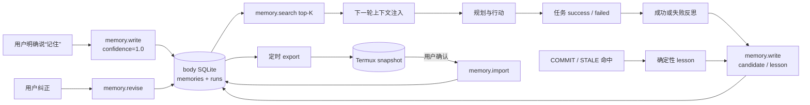

# 15 · 记忆与自进化架构（ME 系列）

> 立项：2026-08-20（v0.1.0 发版后）。目标：**越用越聪明、越来越懂主人、不丢记忆**。
> 结论先行：pi-agent-core 无自进化能力（源码核验见 §1），三层记忆 + 反思闭环为本项目自建；存储选型经历「body SQLite（直觉）→ brain JSONL（复审质疑）→ **body SQLite 终审 + ME-8 备份补丁**」三轮，过程与理由见 §4。
>
> 2026-08-21 审计校准：“不丢记忆”仍是目标而非已证承诺。当前存在注入被技能提示覆盖、run 重复归档、`memory.revise` 缺 PII 校验，以及快照未原子写入/未纳入忽略规则等缺口，见 [docs/16](16-当前架构代码审计-2026-08-21.md)。

## 1. pi 能力全景与边界（0.84.2 源码核验）

| 能力 | 形态 | 结论 |
|---|---|---|
| Agent Loop | `state.messages` 内存数组 + steering 插话 + `transformContext` 钩子 | 运行时框架，进程死即失 |
| Session 持久化 | `JsonlSessionRepo`（JSONL 文件）+ fork/branch/lane 会话树 | 可用但 AD-05 已裁掉（只用 Loop） |
| 上下文压缩 | `compaction/`：token 预算内摘要折叠 + branch-summarization | 窗口管理，非长期记忆 |
| 知识技能 | `loadSkills`：SKILL.md 目录加载 → prompt 注入 | 说明书级，非动作回放（P2 可借鉴） |
| 会话搜索 | `createScanningSessionSearch`：线性文本扫描 | 无向量无嵌入，search-as-you-type 级 |
| **记忆提取/反思/分层/检索注入** | **无** | **零——自进化完全自建** |

## 2. clowder-ai 借鉴点（GitHub 抓取 2026-08-20）

- **Iron Law**："We don't delete our own databases"——记忆是资产不是垃圾
- 分层共享记忆：evidence store（证据）/ lessons learned（教训）/ decision logs（决策）
- 持久身份：persona 跨会话、抗上下文压缩
- 其存储用 Redis（桌面/服务端）——**本项目换 SQLite**（移动设备，零服务零依赖）

## 3. 三层记忆模型

| 层 | 内容 | 现状 | 目标 |
|---|---|---|---|
| 情景 Episodic | run 快照、trace、断点 | runState.json 30 条环形（**会丢**） | SQLite 全量归档，环形改增量 |
| 语义 Semantic | 主人的事实/偏好/习惯/关系（"少糖奶茶""快递放前台"） | **无** | ME 核心新建 |
| 程序 Procedural | 操作技能（签名步进回放）+ 失败教训 | 技能飞轮 ✅；教训散落 handoff | lessons 入库自动采集 |

## 4. 存储选型：body 侧 SQLite（终审）——三轮决策记录

| 轮次 | 结论 | 依据 | 结局 |
|---|---|---|---|
| ① 直觉定向 | body SQLite | "移动设备用 SQLite"（用户提议） | 进入初版规格 |
| ② 复审质疑 | 拟改 brain JSONL | 数据流向（brain 读写过 RPC）/ body 沙箱存活率（pm clear 丢）/ JSONL 零依赖可审计 | 用户自认"乱说的"要求重新论证；恰逢并行会话已按①落地 ME-0~3 |
| ③ 终审 | **维持 body SQLite + 增补 ME-8 备份** | 复审三理由在落地现实下重估：①loopback RPC 实测毫秒级且全系统本就是 RPC 架构（perceive.screen 更高频同样走）；②Android 原生 SQLite 零编译依赖，反而规避 Termux 原生模块（better-sqlite3）编译风险；③存活率硬伤真实但**换存储位置不是唯一解**——ME-8 备份导出补丁更精准（brain 定期全量拉取记忆快照落 Termux + 恢复导入），兼顾 Iron Law 与换机迁移 | 定稿 |

clowder 用 Redis 是服务端 multi-agent 共享场景；我们单用户单机，其精髓（证据层可回源/派生视图可重建/治理与真相分离）与介质无关。

存储实现（ME-1 已落地）：`MemoryStore` 经 `MemoryDb` 行级接口隔离，`AndroidSqliteMemoryDb` 为唯一生产实现，JVM 单测用内存 fake 全覆盖。库文件实际在 `databases/memory.db`（SQLiteOpenHelper 默认路径——M1 真机实测确认，2026-08-21 口径修正）。合并/检索/脱敏规格见 §8.3 与 docs/06 ME-1 行。

## 5. 自进化闭环（brain 侧，ME-2/3）

| 入口 | 数据来源 | 可信度 | 是否阻塞主任务 |
|---|---|---:|---|
| 用户明确记住 | 用户原话 | 1.0 | 是，写入结果直接返回 |
| 成功反思 | LLM 从 goal/trace/result 提取 | 0.5 起 | 否，异步 |
| 失败反思 | LLM 单条归因 | 0.5 起 | 否，异步 |
| gate lesson | 确定性安全/失配事件 | 0.5 起 | 否，异步 |
| 用户纠正 | 用户最新意志 | 权威 | 是 |

注入位置：`buildSystemPrompt`（我们自己的代码层，不动 pi 的 transformContext）。

## 6. 隐私红线（先于功能）

- 记忆纯本地（app 私有目录 SQLite），永不随事件/日志出设备
- 写入前过 redact 规则：身份证/卡号/密码/验证码不入库
- 用户可查可删（forget 物理删）；管理面 ME-4（悬浮层/通知快捷入口）

## 7. 分期与实施计划（2026-08-20 细化，规格已入 docs/06 §7）

| 期 | 内容 | 状态 | 落点 |
|---|---|---|---|
| ME-0 | 契约 4 类型 + 双侧镜像测试 | ✅ 2026-08-20 | 当时新增后共 29 类型；当前契约镜像已扩展为 34 个共享类型并通过 |
| ME-1 | body MemoryStore(SQLite) + 4 RPC | ✅ 2026-08-20 | body/core `memory/MemoryStore.kt`（MemoryDb 行级接口隔离 SQLite，JVM 可测）+ BodyCore 注册（MemoryStoreTest 11 项；真机 SQLite 落盘待验） |
| ME-2 | brain 闭环：reflect + 注入 + 记住工具 | ◐ 2026-08-20 | 主链已实现；技能命中时覆盖已构造的记忆上下文，需改为可组合上下文（docs/16 C-08） |
| ME-3 | lessons 自动采集（gate/SKILL_STALE 钩子）+ runs 全量归档迁移 | ◐ 2026-08-20 | SQLite 归档已实现；终态多写会重复归档且 outcome 可能被外层覆盖（docs/16 C-05） |
| ME-5 | 失败反思（failed/crashed run → LLM 归因 lesson） | ✅ 2026-08-20 | `buildFailureReflector`：任务失败异步归因提取 0-1 条 lesson（parseFailureLessons 强制 lesson+单条上限）；aborted 不反思；四 catch 点接线（text_input/REPL×2/语音轮次），smoke 24 项 |
| ME-4a | 记忆管理入口（用户可查可删的 UI 面） | ◐ 工作树进行中 | 主界面入口、active 列表和物理删除已接线；APK/真机交互待验，悬浮层入口仍属 P2 |
| ME-6 | 记忆生命周期（衰减/容量治理） | ◐ 工作树进行中 | `memory.maintain`、月度触发和基础衰减单测已新增；容量边界与触发水位仍需专项验证 |
| ME-7 | 进化度量（命中率/成功率对比/复用率） | ◐ 工作树进行中 | `memoriesInjected` 已贯通契约、归档和 mock，并新增 `npm run evolve-report`；尚缺专项测试、足量真实样本与指标解释基线，不能据此宣称已经“变聪明” |
| ME-4b | 端侧嵌入检索评估 | 📐 P2 | LIKE 关键词 → 嵌入向量对比 |
| ME-8 | 记忆备份导出/恢复（终审补丁：解 pm clear/换机丢记忆——§4 轮③） | ◐ 2026-08-21 | 导出/导入、6h 快照、恢复确认已实现；快照仍需原子写、schema/checksum、权限与仓库忽略治理（docs/16 C-11/C-14） |

### 实施决策（本轮定，评审可推翻）

- **存储隔离**：MemoryStore 经 `MemoryDb` 行级接口读写（insert/update/delete/findById/active）；`AndroidSqliteMemoryDb`（files/memory.db v1）为唯一生产实现——android.database.sqlite 不进 JVM 单测，逻辑层用内存 fake 全覆盖。
- **检索**：复用 body/common `tokenize`（汉字 1+2gram+拉丁串）；score = 查询覆盖率 + 0.05×confidence + 0.001×min(hits,50)，updated_at 兜底排序；返回条目 hits+1（命中加权）。
- **脱敏单侧**：写入路径全在 brain（memory.remember 工具 / reflect 提取器），复用 guards/redact.ts——打码命中（返回值≠原文）即**拒绝入库**，非入库打码版（§6"不入库"语义）。
- **注入位置**：promptAgent 每轮任务前 memory.search top-5，以【主人记忆】块前缀注入 enrichedInput（与技能路由同模式，不重建 Agent、不动 pi 内核）。
- **reflect 跟随模型链**：与 relevance/vision 同在 rebuildSidecars 重建（防降级脑裂）；ME_REFLECT=0 可关；local 闲聊模式不建。
- **reflect 触发点**：tools 层 task.finish 证据核验通过后 `void reflect(...)` fire-and-forget——提取失败只记日志，绝不阻塞任务完成路径。

## 8. 自进化完备性规格（2026-08-20 补——ME-0~3 落地后的缺口盘点）

### 8.1 失败反思（ME-5，本轮落地）

现状闭环缺口：reflect 只在**成功**后提取用户事实/偏好；lessons 只覆盖**确定性 gate 事件**。
失败任务的归因（为什么失败、下次怎么避开）是 clowder "lessons learned" 的另一半。

- 触发：任务终态 failed/crashed（catch 路径）→ 异步 LLM 归因，提取 0-1 条 lesson（kind 强制 lesson）
- **不触发**：aborted（用户主动停止——非能力问题，反思会污染教训库）；closed（对话型收笔，无任务语义）
- source=`run-fail:<goal摘要>`，redact 同红线；与 gate-lesson 天然去重（同 topic 同 content → confidence 强化）
- 每 run 至多 1 条（失败归因宁缺毋滥，防教训库被低质失败灌水）

### 8.2 记忆生命周期（ME-6，📐 P1末）

| 规则 | 规格 |
|---|---|
| 衰减 | active 记忆 90 天未命中（updated_at 距今）→ confidence ×0.9，周期任务月度执行 |
| 容量治理 | active > 500 条 → confidence 最低且 hits=0 的批次转 revoked（软删归档，Iron Law 不物理删） |
| 物理删 | 仅用户 forget（ME-4a 入口），操作日志不含内容 |

### 8.3 冲突裁决矩阵（已由合并机制承载，规格固化）

| 场景 | 行为 |
|---|---|
| 同 topic 同 kind 同 content | 重述强化：confidence+0.1 cap 1.0 |
| 同 topic 同 kind 不同 content | 新版入库、旧版 revoked 留痕（谁后写谁生效——时间序权威） |
| 源可靠性 | user-told/user-corrected 写入 confidence=1.0 起步；reflection/gate-lesson 0.5 起步靠重述与命中爬升 |
| 用户纠正 | memory.revise 直接改写（不改 confidence——纠正即最新意志） |

### 8.4 进化度量（ME-7，📐 P1末——"越用越聪明"必须可证）

- **注入有效性**：记忆注入开启/关闭（A/B 开关）下任务成功率对比（runs 表已有 outcome 全量，直接可算）
- **记忆命中率**：注入条目中实际被 trace 使用相关的比例（P1 用 LLM 判官离线评估，P2 端上埋点）
- **lesson 复用**：gate-lesson/run-fail 入库后同 topic 再拦截/规避次数（hits 字段直接可读）
- **技能复用率**：skill.run 成功占比（SkillStats 已有，纳入月度报表）

### 8.5 管理面拆分（ME-4 → ME-4a/4b）

原 ME-4 混装了「隐私承诺兑现」与「检索升级」两件事，按优先级拆开：
- **ME-4a 记忆管理入口（P1）**：§6 隐私红线承诺“用户可查可删”。当前工作树已加入主界面入口、active 记忆列表和 `memory.forget` 删除；APK/真机验证前仍标 ◐，悬浮层快捷入口 P2。**这是隐私承诺的兑现项，不是功能增强**。
- **ME-4b 端侧嵌入检索（维持 P2）**：2-gram 关键词在百级记忆规模下够用，嵌入检索在规模/多义场景才显优势。
