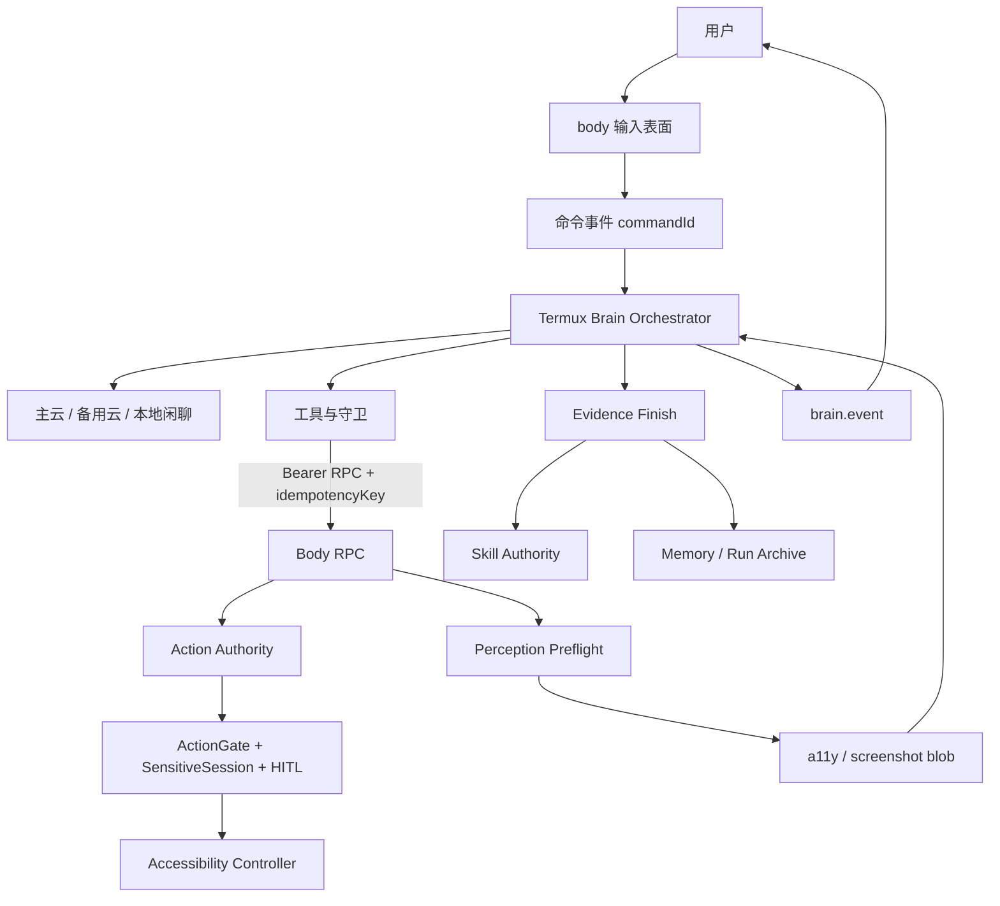
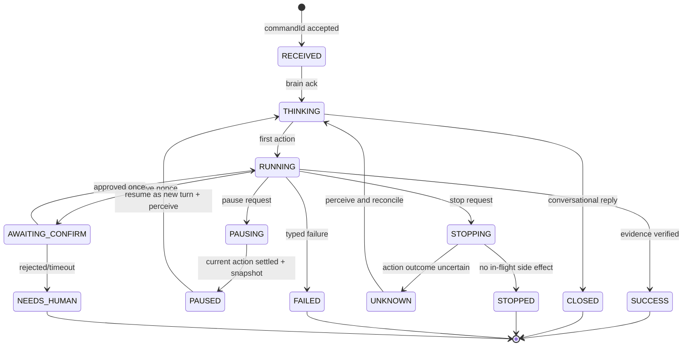
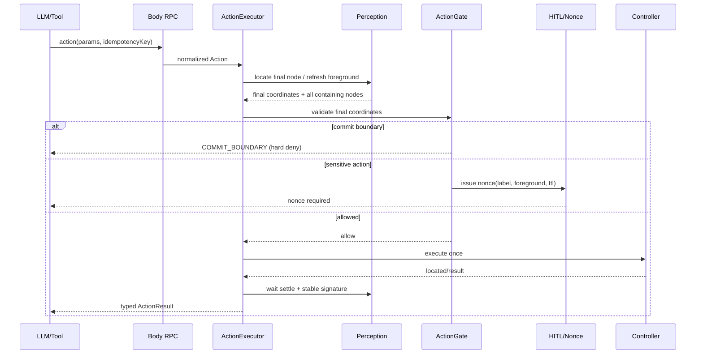
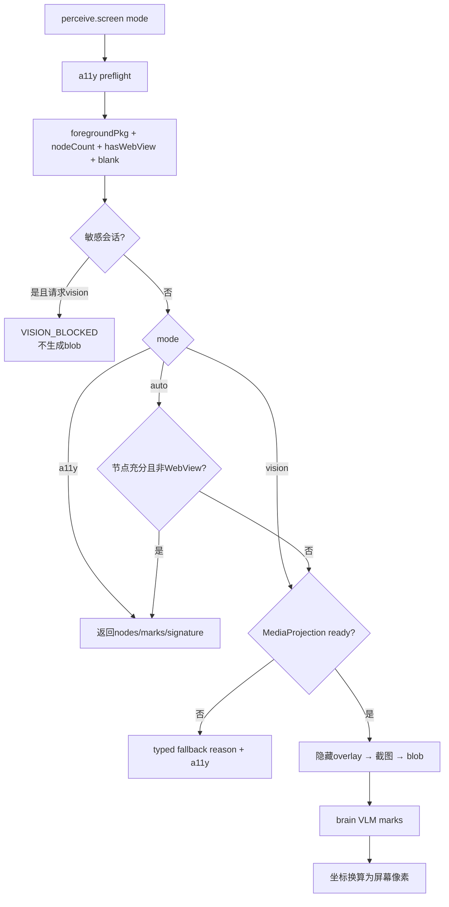
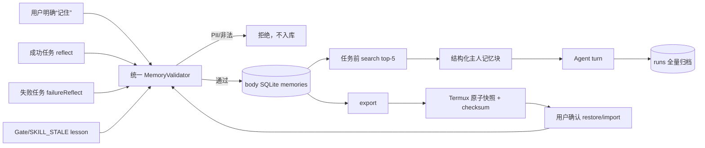

# 17 · SuperAgent-Android 当前方案设计

> 基线：2026-08-21，`571828e`。
> 本文描述当前代码基础上的目标方案；已发现但尚未修复的差距引用 `docs/16`，不把目标设计冒充已实现。

## 1. 设计目标

在免 root Android 设备上提供一个可审计、可暂停、可恢复的系统级 Agent。brain 可以产生计划，但不能绕过 body 的设备权威；任何成功结论必须由设备现场证据支撑；长期记忆必须可查、可删、可备份且默认不泄露。

非目标：P1 不引入多 body、不依赖 root、不自动执行支付/提交、不让本地弱模型控制设备、不把所有 Android OEM 保活问题伪装成可解决。

## 2. 运行时组件

| 组件 | 单一职责 | 依赖 |
|---|---|---|
| Input Surfaces | 文字、通知、语音触发；产生带 commandId 的命令 | body EventBus |
| Brain Orchestrator | 串行消费命令、装配上下文、驱动 Agent turn | pi-agent-core、BodyClient |
| Model Router | 主云、备用云、本地闲聊降级 | pi-ai |
| Tool/Guard Layer | 工具 schema、ReAct 止损、证据闸门、脱敏 | runState、BodyClient |
| Body RPC | 鉴权、协议、幂等、超时与 typed denial | NanoHTTPD、CoroutineScope |
| Action Authority | 最终动作校验和执行 | ActionExecutor、ActionGate、HITL |
| Perception Router | a11y preflight、敏感同步、vision 路由 | Accessibility、MediaProjection |
| Skill Authority | 技能索引、签名回放、生命周期 | body files/SQLite |
| Memory Authority | 记忆合并、修订、删除、检索、归档 | body SQLite |
| UI State Authority | 将事件归并为唯一用户可见状态 | UiStateController |

## 3. 当前目标拓扑



网络边界：body 当前监听 `0.0.0.0:8765` 以适配 Android/Termux 的 UID 网络隔离，使用随机 256-bit Bearer token；这仍是内部版折中。目标是在不破坏 Termux 可达性的前提下改为 Unix domain socket 或受限转发。只有 brain 访问外部 LLM/TTS 服务。

## 4. 命令与任务生命周期



状态图的关键不是 UI 颜色，而是每个终态只有一个写者；PAUSED/UNKNOWN 必须先重建现场，不能把清布尔值或重试当恢复。

### 4.1 命令受理

每条文字/语音命令必须有稳定 commandId 和受理结果：

- brain 在线：body 入队并显示“已收到”；brain ack 后转 THINKING。
- brain 离线：P1 默认明确拒绝并保留输入草稿，不显示已受理。
- 若未来支持离线队列，事件必须持久化并带 resolution，brain 不得用“跳过全部历史事件”代替去重。

### 4.2 上下文装配

上下文使用结构化顺序，禁止字符串互相覆盖：

1. persona 与安全系统规则；
2. 主人长期记忆 top-5；
3. 匹配技能 top-3；
4. 断点续跑现场摘要；
5. 当前用户命令。

记忆和技能检索均 fail-open，但失败要有诊断事件；本地闲聊层不注入设备工具。

### 4.3 终态单写者

Brain wrapper 是 run 终态唯一写者。工具只改变过程事实：

- `task.finish`：验证证据并设置 finishVerified，不直接归档。
- `hitl.handoff`：设置 needsHuman 标志。
- stop：设置 aborted/stopped 原因。
- wrapper 在 Agent turn 退出后一次性选择 outcome、持久化并归档。

`finishRun` 必须幂等。允许续跑的状态采用显式表：interrupted、failed、crashed、paused、needs_human；success、closed、aborted 不可续。

## 5. 动作安全方案



每个设备副作用遵循固定顺序：

1. 解析并规范化参数；
2. 若是语义选择，定位最终节点；
3. 对最终坐标检查全部包含节点；
4. 检查提交边界；
5. 检查敏感会话与一次性 nonce；
6. 执行动作；
7. 等待界面 settle，生成稳定签名；
8. 记录 typed result 和 UI 事件。

参数 label 是提示，最终坐标和真实前台页面才是 body 权威。RPC、技能回放、selector 内部点击不得直接调用 Controller 绕过第 3～5 步。

支付/提交边界保持硬拒绝；敏感但非提交动作可经 nonce 单次放行。任何感知失败在敏感会话内 fail-closed。

## 6. 感知方案



所有 mode 先执行一次轻量 a11y preflight，产出 body 内部结构：

```text
foregroundPkg · nodeCount · hasWebView · sensitiveSession · blank
```

随后路由：

- `a11y`：返回结构化节点和签名。
- `vision`：若 sensitiveSession=true，拒绝且不生成 blob；否则确认 MediaProjection ready 后截图。
- `auto`：节点充分且无 WebView时用 a11y；否则尝试 vision；vision 不可用则带原因回退 a11y。
- `ocr`：当前未实现，返回 typed unavailable，不伪装为 a11y。

MediaProjection 授权结果必须 attach 到 BodyCore 持有的同一 ScreenshotService。截图隐藏 overlay，滚动保留有限数量，GET blob 使用 no-store；P1 增加脱敏区域策略后才能扩大敏感页面视觉范围。

## 7. 暂停、停止与恢复

采用“动作边界暂停 + 新 turn 恢复”，不承诺冻结正在执行的单个 Android 手势：

1. 用户请求暂停，UI 进入 PAUSING。
2. brain 停止下发新动作；当前动作完成并采集签名。
3. run 以 paused 状态持久化，UI 收到 paused ack 后进入 PAUSED。
4. 用户继续时，brain 通过断点续跑构造新 prompt，第一步强制重新感知现场。

停止进入 STOPPING，brain abort Agent turn；若存在已下发但结果未知的动作，进入 `unknown_side_effect`，必须先 perceive 再决定 STOPPED/FAILED。resume 不能只是清一个布尔变量。

| 用户动作 | body 立即状态 | brain 边界动作 | 可恢复方式 |
|---|---|---|---|
| 暂停 | PAUSING | 不再下发新动作，等待当前动作 settle | PAUSED 快照 → 新 turn |
| 继续 | 保持 PAUSED 直到 ack | 重新感知并注入 resume context | THINKING → RUNNING |
| 停止 | STOPPING | abort Agent；核对在途动作 | STOPPED 或 UNKNOWN |
| 新任务 | RECEIVED | 显式关闭/放弃旧 run | 新 commandId |

## 8. 技能与证据闭环

技能命中优先回放，但每步执行前比较 expectedSignature；失配立即返回 completedSteps 和 failedStep，从现场续走。技能执行完成不等于目标完成，仍需 `task.finish`。

证据门分三层：

- 硬门：证据存在于当前屏幕；
- 硬门：证据相对 baseline 新颖；
- 软门：证据与目标相关，判官不可达时 fail-open。

验证成功且有效动作不少于 2 步时学习 candidate；成功归档只写一次。重复证据驳回三次转人工。

## 9. 记忆与自进化方案



| 层 | 内容 | 写入来源 | 生命周期 |
|---|---|---|---|
| 语义记忆 | fact/preference | 用户明确陈述、成功反思 | 修订留痕、用户可删 |
| 程序记忆 | routine/技能 | 成功轨迹与反馈 | candidate→verified→active/deprecated |
| 教训记忆 | lesson | 失败反思、gate、stale | 命中加权、后续衰减 |
| 情景归档 | run + trace | 终态单写者 | 全量审计，受容量治理 |

body SQLite 是记忆和 run 的权威库，brain 只负责提取和注入。四类记忆为 fact、preference、lesson、routine。

所有写路径共用同一个 validator：write、revise、import、reflect、failureReflect、gate lesson。validator 执行长度、kind、PII 和来源校验；用户 forget 物理删除，系统修订采用 revoked 留痕。

备份采用：

- body 全量 export（含 revoked）；
- Termux 私有目录、权限 0600；
- `schemaVersion + generatedAt + checksum + entries`；
- 临时文件写入并 fsync/rename，保留 last-good；
- 恢复前校验，展示 active 条目，用户确认后补缺导入。

“越用越聪明”在 ME-7 指标完成前只作为方向，不作为已证明结果。

## 10. IPC 与错误语义

body RPC 保留 Bearer、protocolVersion、bootId、请求上限、幂等缓存。处理器改由 BodyCore 生命周期管理的 CoroutineScope 执行；stop 时取消 scope。

错误分为：

- denial：COMMIT_BOUNDARY、VISION_BLOCKED、HITL_REJECTED；
- unavailable：A11Y_DISCONNECTED、SPEECH_UNAVAILABLE、BODY_UNAVAILABLE；
- stale：SKILL_STALE、PROTOCOL_MISMATCH；
- uncertain：UNKNOWN_SIDE_EFFECT。

TIMEOUT 不能等同“没有执行”。不可取消的外部副作用超时后必须返回 uncertain，并触发现场重建。

## 11. 交付顺序与验收门

| 批次 | 内容 | 验收 |
|---|---|---|
| S0 | selectOption 最终坐标闸、vision preflight | 重叠节点/敏感 App 单测与真机 |
| S1 | attach 授权、WebView 路由 | MediaProjection + WebView 真机 |
| S2 | 终态单写、closed/paused 策略 | 每任务恰好一条归档；状态表测试 |
| S3 | pause/resume、离线输入 ack | UX-05/离线输入真机 |
| S4 | 记忆 prompt、统一 PII、原子快照 | 注入组合、revise/import、损坏快照测试 |
| S5 | structured concurrency、uncertain | timeout 后不盲重试测试 |

任何批次完成都必须同步 contract/Protocol/types（若类型变化）、docs/06 状态、docs/08 验收证据和 CHANGELOG。

## 12. 当前能力边界

- 已确认：a11y 感知、基础动作、body 安全主链、HITL nonce、技能签名回放、证据闸门、SQLite 记忆、在线 TTS→body 播放、系统 TTS 兜底。
- 部分完成：vision、WebView auto、暂停/继续、常驻可靠性、记忆管理 UI、备份健壮性。
- 待真机：本轮所有 Android 设备行为、OEM 后台限制、声纹 identify、语音版完整 TC-07。
