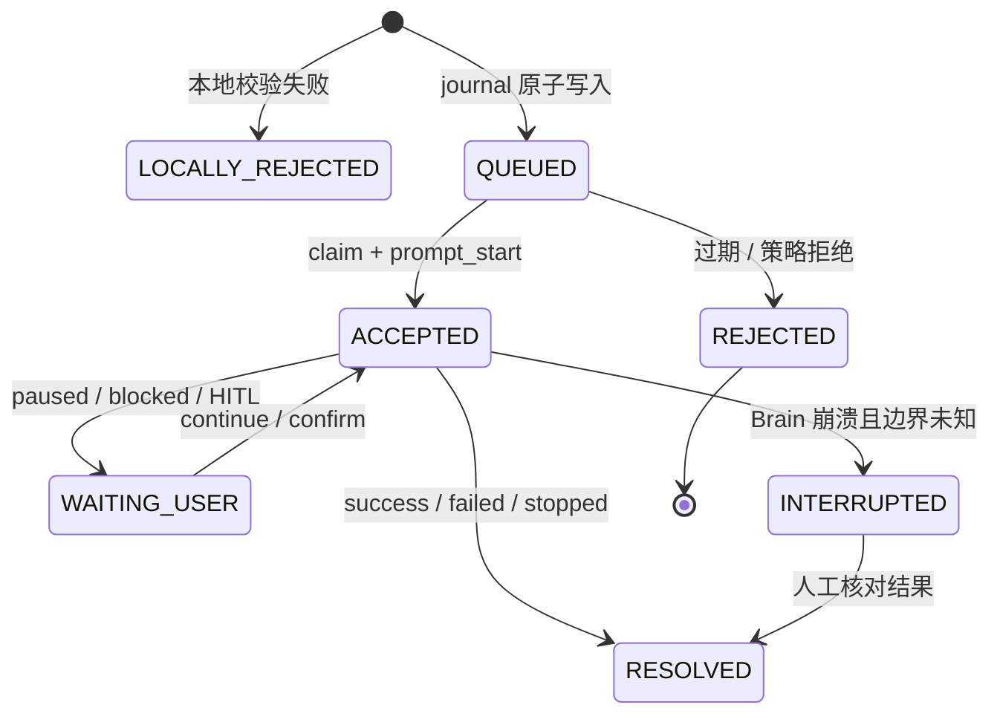
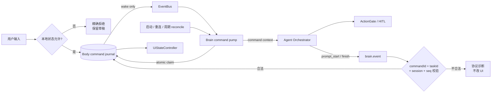
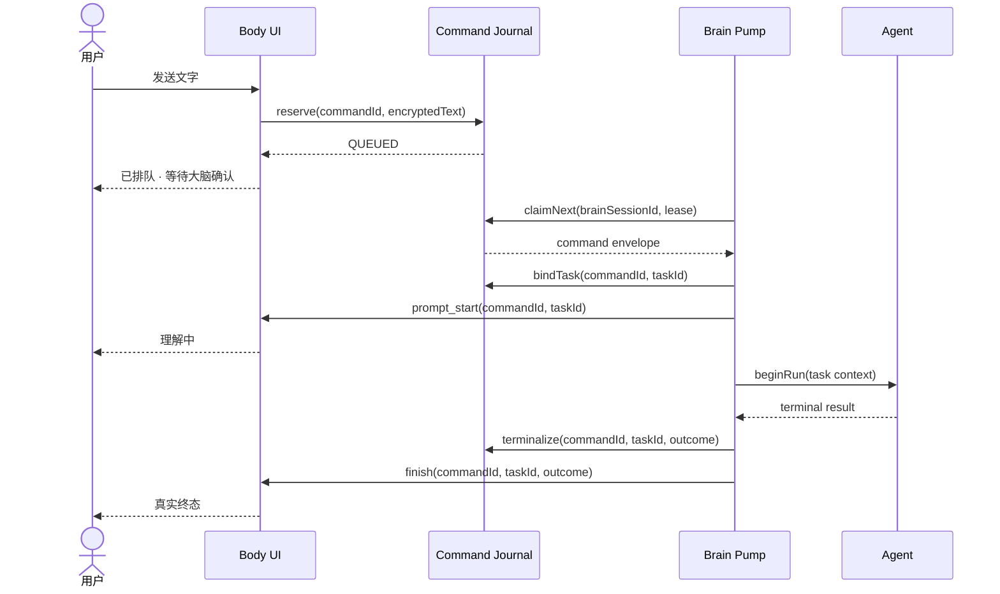

# BR-10 / CT-06 跨进程命令受理闭环设计

> 状态：已冻结设计，待分阶段实现。负责人：GPT（UX / 安全 / 审计）+ GLM（架构 / 存储 / 推进）。

## 1. 问题与设计结论

当前 `submitTextInput() == true` 只证明文字写入了 Body 进程内的易失 `EventBus`，不能证明 Brain 已收到。Brain 重启会跳过存量事件，Body 重启又会令事件 `seq` 从 1 重新开始；因此不能继续把本地写入显示为“已收到 · 正在理解”。

本设计选择 **Body 持久命令日志 + Brain 原子领取**。`EventBus` 降为唤醒通知，命令身份和状态以 Body 的 journal 为准；`prompt_start` 才表示 Brain 接受，真实终态才表示命令解决。

## 2. 用户语义

| 阶段 | 权威事实 | 用户文案示例 | 禁止误解 |
|---|---|---|---|
| `LOCALLY_REJECTED`（非 journal 状态） | reserve 前校验失败，命令未进入 journal | `未发送 · 大脑离线` / `未发送 · 当前任务正在停止` | 不能生成 taskId |
| `QUEUED` | Body 已持久保存 command envelope | `已排队 · 等待大脑确认` | 不代表 Brain 已接收 |
| `REJECTED` | 已 reserve 的命令因过期或 Brain 策略被持久拒绝 | `未执行 · 请修改后重试` | 保留 receipt，不生成执行 task |
| `ACCEPTED` | Brain 原子领取并回报 `prompt_start` | `理解中 · 目标：…` | 同一 commandId 不得映射第二个 taskId |
| `WAITING_USER` | 已暂停、阻塞或等待确认 | `已暂停` / `需要你处理` | 尚未 resolved |
| `RESOLVED` | 持久终态已写入，并发出匹配的 `finish/error` | `已完成` / `未完成` / `已停止` | `unknown_side_effect` 不能伪装成功 |
| `INTERRUPTED` | 已接受但 Brain 崩溃，无法证明副作用边界 | `执行中断 · 请核对后重试` | 禁止自动重放设备动作 |

## 3. 方案比较

| 方案 | 重启安全 | 去重边界 | 架构代价 | 结论 |
|---|---:|---:|---:|---|
| A. 易失 EventBus 增加 commandId | 否 | 单进程内存 | 低 | 仅可止住假文案，不能关闭 BR-10 |
| **B. Body journal + 原子 claim** | **是** | **跨进程、跨重启** | 中 | **采用** |
| C. Body 同步调用 Brain command RPC | 取决于 Brain inbox | 可实现 | 高，反转现有拉取方向 | 不采用 |

## 4. 目标架构

组件边界：

| 组件 | 唯一职责 | 不负责 |
|---|---|---|
| Command journal | commandId 唯一、状态迁移、claim lease、终态审计 | 执行设备动作 |
| EventBus | 通知“可能有新命令” | 命令耐久性与身份 |
| Command pump | 按 journal 顺序领取并创建 task context | 以事件 seq 伪造 commandId |
| Brain event reporter | 使用显式 task context 串行上报 | 依赖全局可变 taskId 猜归属 |
| UiStateController | 校验回执并展示真实阶段 | 把本地排队显示成 Brain accepted |

## 5. 协议与数据模型

### 5.1 Command journal

| 字段 | 类型 | 约束 |
|---|---|---|
| `commandId` | UUID | Body 在发布前生成，主键且永不复用 |
| `bodySessionId` | UUID | Body 每次启动变化 |
| `bodySeq` | Long | 仅诊断顺序，不作为命令身份 |
| `textCiphertext` | bytes / protected text | 本机短期保存；普通日志禁止记录明文 |
| `status` | enum | `QUEUED/CLAIMED/ACCEPTED/WAITING_USER/RESOLVED/REJECTED/INTERRUPTED` |
| `brainSessionId` | UUID? | claim 时写入；旧 session 不得继续推进 |
| `taskId` | string? | 首次 accept 原子绑定，此后不可更换 |
| `leaseUntil` | timestamp? | claim 崩溃回收依据 |
| `outcome` | enum? | success/failed/stopped/unknown_side_effect 等，不复用动作 `resolution` |
| `createdAt/updatedAt` | timestamp | 审计与 TTL 清理 |

### 5.2 兼容字段

共享 `BodyEvent` 与 `BrainEvent` 分阶段增加可选字段，旧版本可以解码，但新闭环只有字段齐全并通过 journal 校验时才成立：

| 类型 | 新字段 | 权威规则 |
|---|---|---|
| `BodyEvent` | `sourceSessionId?`, `commandId?` | 顶层字段权威，payload 不得覆盖 |
| `BrainEvent` | `sourceSessionId?`, `commandId?` | 同一 task 的全部事件保持相同值 |
| `prompt_start` | commandId + taskId | 表示 `ACCEPTED`，建立唯一映射 |
| `finish/error` | 同一 commandId + taskId | 表示 resolved 或 waiting/interrupted 分类 |

### 5.3 领取与执行顺序

顺序不变量：`reserve → claim → bind task → prompt_start → act* → durable terminal → finish`。任何重复 claim 或重复事件只能返回已有状态，不能再次调用 `beginRun()`。wake hint 不是可靠交付：Brain 启动后必查、与 Body 重连后必查，并以有上限的周期 reconcile 扫描 QUEUED/过期 lease；即使唯一一次 wake 丢失，命令也必须最终被领取或持久拒绝。

## 6. 重启、乱序与副作用

| 场景 | 处理 |
|---|---|
| Brain 在 claim 前重启 | 新 session 可领取仍为 QUEUED 的命令 |
| Brain 在 accept 后、动作前重启 | 标为 INTERRUPTED；不自动生成第二 task |
| Brain 在动作期间崩溃 | outcome=`unknown_side_effect`，先核对设备，禁止自动重放 |
| Body 重启、Brain 存活 | bodySessionId 变化；Brain 丢弃旧 cursor，从 journal 重新查询 |
| 旧 Brain session 迟到事件 | journal 与 UI 均拒绝，不得重置当前 seq 水位 |
| EventBus 环形队列出现 gap | 只触发 journal 重查；不得猜测命令已处理 |
| reserve 成功后 wake 丢失 | 启动/重连/周期 reconcile 最终发现；不得永久停在 QUEUED |
| 同 commandId 非相邻重放 | 返回既有 command receipt，零新增执行 |

UI 水位为 `(brainSessionId, taskId, seq)`；只按 `taskId + seq` 不足以隔离旧进程事件。

## 7. 控制优先级与本轮已封闭漏洞

优先级固定为 `STOP > PAUSE > RESUME > NEW_TASK`。`PAUSING`、`STOPPING`、`PAUSED` 下提交新文字必须本地拒绝、零 EventBus 发布并保持原状态；若用户要开始新任务，必须先显式停止或放弃旧 checkpoint。

本轮已为该状态倒退补回归测试和最小修复；持久 journal、claim 和跨进程回执仍属于后续实现，不能据此把 BR-10/CT-06 标为完成。

## 8. 安全与隐私

- journal 不允许普通日志记录命令明文，只记录 commandId、状态、时间和枚举原因。
- 命令正文必须受 Android 本机存储保护并设置 TTL；清理需保留最小审计 receipt。
- claim/ack 路径不调用 `control.*`、不消费 HITL nonce，也不绕过 ActionGate。
- `unknown_side_effect` 必须进入核对或人工处置，不能被自动重试转换为 success。
- 枚举未知、关联不匹配、旧 session 事件全部 fail-closed，并记录脱敏诊断。

## 9. 验收矩阵

| ID | 场景 | 通过标准 |
|---|---|---|
| CA-01 | 快速双击 / 同 commandId 重放 | 一个 journal 行、一次 claim、一个 taskId、一次 beginRun |
| CA-02 | 相同文本再次明确发送 | 新 commandId，可形成新任务 |
| CA-03 | OFFLINE/PAUSING/STOPPING/PAUSED 提交 | 零发布；状态不倒退；显示精确拒绝并保留草稿 |
| CA-04 | 排队后 Brain ack 前断连 | 只显示 QUEUED；重连最多领取一次 |
| CA-05 | Brain 重启 | QUEUED 可领取；ACCEPTED 不自动重放动作 |
| CA-06 | Body 重启 | 新 session 的低 seq 不被旧 cursor 永久屏蔽 |
| CA-07 | 旧 Brain session 高 seq 迟到 | UI/journal 均拒绝，当前任务不变 |
| CA-08 | prompt_start/finish 关联不匹配 | 拒绝回执，不创建或覆盖权威任务 |
| CA-09 | paused/blocked/unknown side effect | 不标 resolved；等待继续或处置 |
| CA-10 | 日志与数据库抽查 | 普通日志无指令明文；状态迁移可审计 |
| CA-11 | reserve 后唯一 wake 丢失 | 无后续事件也能由 reconcile 最终领取一次或持久拒绝 |

## 10. 完成定义

只有 CA-01 至 CA-11 的代码测试通过，并完成 Brain 重启、Body 重启和真机中断证据后，`BR-10/CT-06` 才能从“设计冻结 / 实现中”升级为“完成”。
