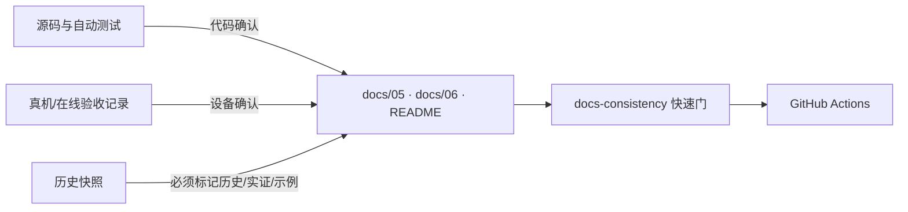

# C15 文档事实漂移治理设计

## 目标与边界

让 README、架构事实源和功能矩阵与当前代码证据一致，并用一个快速、离线、跨平台的检查阻止已关闭缺口重新出现在文档中。本任务不改变产品行为，不把 JVM 测试替代成真机证据，也不改写历史验证记录。

## 方案比较

| 方案 | 优点 | 缺点 | 裁决 |
|---|---|---|---|
| 仅人工校准 | 改动最小 | 下一次提交仍会漂移 | 不采用 |
| 校准 + 窄一致性测试 | 能阻止已知陈旧断言和架构型号绑定；实现简单 | 新类别仍需人工补规则 | **采用** |
| 从源码生成全部文档 | 理论上单源 | 破坏可读性，生成器维护成本高 | 暂不采用 |

## 事实分层

| 证据 | 允许状态 | 禁止推断 |
|---|---|---|
| 本地自动测试通过 | 代码闭环/测试确认 | 真机可用、在线 provider 可用 |
| 真机日志/录屏 | 对应设备行为已验 | 所有 OEM 都可靠 |
| 某型号历史实证 | 可作为历史或配置示例 | 架构绑定该型号 |

## 检查器边界

`brain/test/docs-consistency.ts` 读取仓库内固定事实源（README、docs/05、06、14、17），执行三类断言：

1. 已关闭整改项不得再出现已知陈旧短语，例如 selector 最终闸待补、vision 授权未 attach、resume 只有布尔门。
2. 架构性段落不得出现“GLM 主模型”等厂商绑定；已知型号家族只有局部上下文包含“历史”“实证”“示例”或“当前部署”时允许。
3. README 必须公开 `MODEL` 与 `VISION_*` 的可配置关系，并列出专用恢复/视觉验证脚本。

检查器只输出文件、行号和规则，不修改文档。CI 在 typecheck 后执行 `npm run docs-consistency`。

## 验收

- 测试先对当前陈旧文档失败，且失败项对应真实漂移。
- 校准后测试通过。
- `typecheck`、`contract`、`smoke`、`integration` 继续通过。
- 真机相关行仍保留“待真机/待设备”边界。
