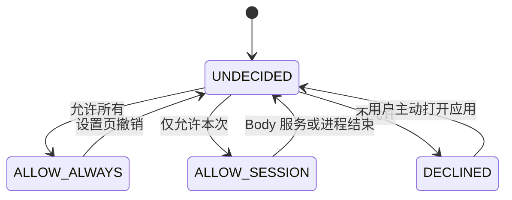
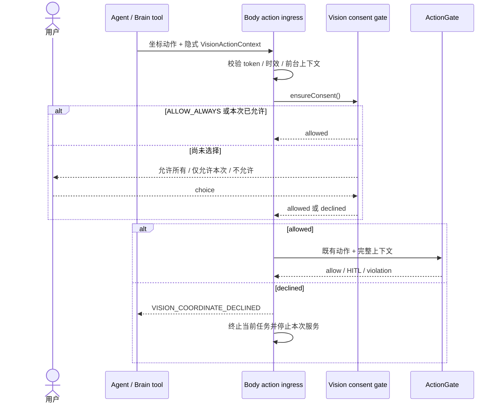

# 视觉坐标风险授权设计

> 状态：用户已批准行为设计，待实施计划。  
> Owner：GPT（UX / 用户行为 / 安全） · Reviewer：GLM（架构 / 接线）。  
> 范围：保留 VLM 坐标执行能力，以首次三态授权取代默认禁用；不改变支付、授权、删除等提交边界。

## 1. 目标与非目标

当前 VLM 输出即使通过语法和屏幕边界校验，也可能属于错误的语义坐标系。项目本阶段以功能实现优先，不禁用视觉点击；在首次执行 VLM 来源坐标前，必须让用户理解并选择风险策略。

本批目标：

- 首次视觉坐标动作提供“允许所有 / 仅允许本次 / 不允许”三种选择。
- “允许所有”持久生效；“仅允许本次”只在当前 Body 服务生命周期生效。
- “不允许”安全结束当前工作并停止提供服务，但用户主动重新打开应用后可以重新选择。
- 授权只接受视觉坐标偏移风险，不改变现有 ActionGate、HITL、敏感会话和提交边界。

本批不做：

- 不宣称 VLM 坐标已完成真机标定。
- 不实现 SoM 编号徽章，也不把某个视觉模型写入架构。
- 不允许模型用任意布尔字段自称“用户已授权”。
- 不永久封禁应用，不要求清除数据或重新安装才能恢复。

## 2. 用户行为

### 2.1 三态选择

| 选择 | 当前视觉动作 | 保存范围 | 后续行为 |
|---|---|---|---|
| 允许所有 | 继续进入既有 ActionGate | 本机持久化 | 重启、升级、换 App 或换模型均不再提示；设置页可撤销 |
| 仅允许本次 | 继续进入既有 ActionGate | 当前 Body 服务生命周期内存 | 服务或进程重启后回到未选择 |
| 不允许 | 取消动作并结束当前任务 | 不持久化拒绝 | 停止语音、悬浮交互和任务服务；用户主动重开后可重新选择 |

选择文案必须明确：视觉坐标可能偏移并点击错误位置；高风险提交仍会单独确认。弹窗不得把“允许所有”做成默认选中项，返回键等价于尚未选择，不等价于允许。

### 2.2 生命周期

`DECLINED` 是本次运行的逻辑暂停态，不写成永久拒绝。应用不得在后台自行重启服务；用户从启动器主动打开主界面时清除该运行态，恢复为 `UNDECIDED`。

## 3. 信任边界与组件

### 3.1 组件职责

| 组件 | 职责 | 不得承担 |
|---|---|---|
| VisionActionContext | 证明坐标来自最近一次视觉感知；短期、单设备启动会话有效 | 表示用户已授权，或绕过 ActionGate |
| VisionCoordinateConsentGate | 合并并发询问、读取三态授权、等待用户选择 | 执行业务动作或改变提交边界 |
| VisionConsentStore | 持久化 `ALLOW_ALWAYS`；保存接受/撤销审计元数据 | 保存截图、页面文字、坐标或模型响应 |
| Floating UI / Activity | 显示三选一提示并交付用户选择 | 自行推断选择或超时默认允许 |
| ActionExecutor / ActionGate | 在授权后继续执行既有坐标与安全校验 | 因视觉授权跳过敏感会话/HITL |
| Brain tool runtime | 把最近视觉 mark 与不可见的 context 关联并附到动作请求 | 把 token 暴露给模型文本或允许模型伪造 |

### 3.2 视觉来源凭据

Body 在产生可供 VLM 处理的截图上下文时签发短期 `VisionActionContext`，至少绑定：

- Body boot/session ID；
- screenshot/blob 引用；
- 当时前台包名、屏幕尺寸和页面 signature；
- 签发时间与过期时间；
- 随机不可预测 token。

Brain 的工具运行时保留 token，不把它放进模型可见提示。VLM 成功后，运行时把“最近一次可操作感知来源”设为该 context；在下一次成功感知、任务切换或 context 过期前，所有直接坐标动作及 `near` 坐标都自动附加它。这样模型对 mark 坐标做小幅偏移也不能绕过授权。下一次成功 a11y 感知会明确清除视觉来源，避免后续普通 a11y 动作被误标。

Body 验证 token、时效、启动会话和当前前台上下文后，才把动作识别为视觉坐标并进入授权门。Brain 不传“是否已授权”，最终授权状态只由 Body 决定。

token 无效、过期或上下文改变时返回 typed `VISION_CONTEXT_INVALID`，不得静默降级为普通 tap。没有视觉 context 的现有 a11y/普通动作保持原协议，不被本批授权门误伤。

## 4. 动作时序

顺序不变量：

1. 先验证视觉来源，后询问授权；伪造 token 不得制造可信弹窗。
2. 用户允许只解除“视觉坐标未标定”这一层风险。
3. ActionGate 与提交边界始终在授权之后继续生效。
4. 同时到达的视觉动作共享一个询问，用户选择前不执行任何一个动作。

## 5. 拒绝、恢复与失败处理

### 5.1 用户选择“不允许”

按结构化顺序执行：

1. 当前视觉动作返回 `VISION_COORDINATE_DECLINED`，零设备副作用。
2. 当前任务进入用户终止语义，不伪装为模型失败或成功。
3. 停止语音监听/播报、悬浮交互和任务处理服务，关闭应用界面。
4. 不修改 Android 系统中的无障碍授权，不永久禁用组件。
5. 后台不得自行恢复；用户从启动器主动进入主界面后，恢复为 `UNDECIDED`。

### 5.2 UI 暂时不可展示

若系统限制导致授权 UI 无法展示，动作返回 typed `VISION_CONSENT_UI_UNAVAILABLE` 并保持零副作用；提供可点击通知引导用户主动打开应用选择。不得超时默认允许，也不得因此写入“不允许”。

### 5.3 设置撤销

设置页提供“撤销视觉坐标授权”。撤销仅删除 `ALLOW_ALWAYS` 与对应非敏感审计元数据；下一次视觉坐标动作重新出现三态提示。

## 6. 数据与隐私

持久化内容只包括：

| 字段 | 用途 |
|---|---|
| consent = allow_always | 唯一持久授权值 |
| acceptedAt | 审计与问题定位 |
| appVersion | 行为版本说明，不用于自动重提示 |
| revokedAt（可选审计事件） | 记录用户主动撤销 |

禁止保存 screenshotRef、截图、坐标、页面正文、前台 App 历史或模型名称。`ALLOW_SESSION` 与 `DECLINED` 只存在内存，不进入备份或同步。

## 7. 验收矩阵

| 批次 | 必须证明 |
|---|---|
| 三态 | 允许所有持久；仅本次进程内有效；不允许零动作并停止本次服务 |
| 恢复 | 拒绝后后台不自启；用户主动打开后可重新选择 |
| 并发 | 多个视觉动作只弹一次，选择前全部零副作用 |
| 来源 | token 缺失、伪造、过期、boot/session 错配、前台变化均 fail-closed |
| 兼容 | 非视觉 a11y 动作保持现有行为；旧调用方不因缺视觉 token 被误判 |
| 安全 | 允许后支付/授权/删除仍命中 ActionGate/HITL；不得因授权直接执行提交动作 |
| 隐私 | 存储与日志不含截图、坐标、页面正文和 provider/model 名称 |
| UI | 三个选项均可达；返回键不默认允许；UI 不可展示有 typed 失败与通知入口 |

真机验收至少覆盖：首次三选一、服务重启、进程 kill、设置撤销、前台 App 切换、敏感提交边界，以及拒绝后从启动器重新打开。

## 8. 实施边界与退出条件

实现应拆为四个可独立测试的边界：`VisionActionContext`、`VisionCoordinateConsentGate`、授权 UI/Store、动作入口接线。不得把持久化或 UI 逻辑塞进 `ActionGate`。

代码退出条件：单元/集成矩阵全绿，契约三方镜像一致，README、docs/07、docs/09、docs/12、docs/16/17 用图表区分“风险授权已实现”和“坐标语义仍未标定”。无真机证据时只能标“代码闭环，待设备验收”。
